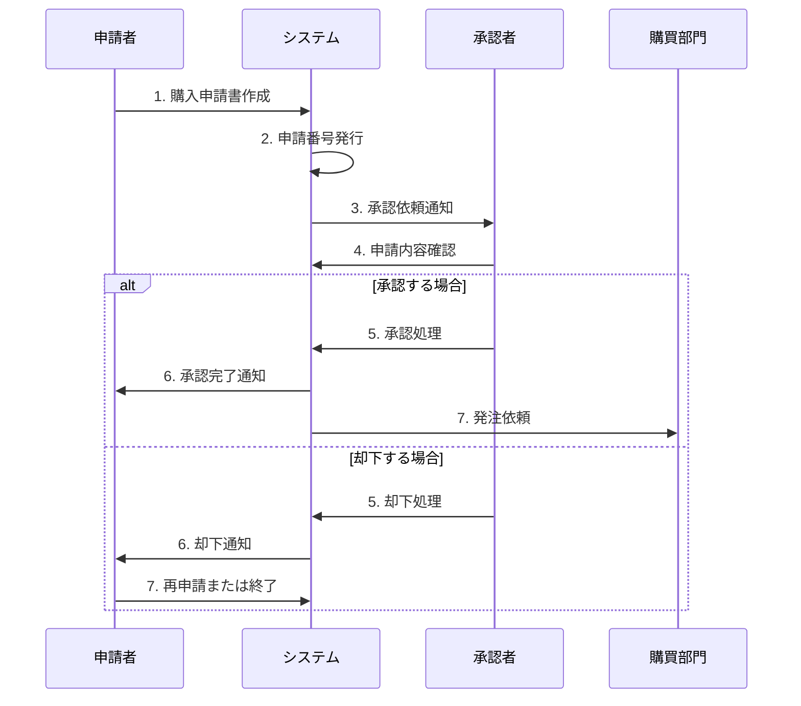

# 業務一覧

## システム名
物品管理システム

## 作成日
2025-11-03

---

## 業務体系図

```
物品管理システム 業務フロー
│
├── 1. 事前準備業務
│   ├── 1.1 社員情報管理業務
│   └── 1.2 物品情報管理業務
│
├── 2. 購入申請業務
│   ├── 2.1 購入申請作成業務
│   ├── 2.2 購入申請承認業務
│   └── 2.3 購入申請却下業務
│
├── 3. 履歴参照業務
│   ├── 3.1 購入履歴検索業務
│   └── 3.2 購入履歴参照業務
│
└── 4. システム管理業務
    ├── 4.1 ユーザー管理業務
    ├── 4.2 権限管理業務
    └── 4.3 システム監視業務
```

---

## 業務一覧表

| 業務ID | 大分類 | 業務名 | 担当者 | 頻度 | 実装状況 | 関連機能ID |
|--------|--------|--------|--------|------|---------|-----------|
| B-001 | 事前準備 | 社員情報登録業務 | 人事担当者 | 随時 | ✅ 完成 | F-101 |
| B-002 | 事前準備 | 社員情報更新業務 | 人事担当者 | 随時 | ✅ 完成 | F-102 |
| B-003 | 事前準備 | 社員情報削除業務 | 人事担当者 | 随時 | ✅ 完成 | F-103 |
| B-004 | 事前準備 | 社員情報参照業務 | 人事担当者 | 随時 | ✅ 完成 | F-104, F-105 |
| B-101 | 事前準備 | 物品情報登録業務 | 総務担当者 | 随時 | ❌ 未実装 | F-201 |
| B-102 | 事前準備 | 物品情報更新業務 | 総務担当者 | 随時 | ❌ 未実装 | F-202 |
| B-103 | 事前準備 | 物品情報削除業務 | 総務担当者 | 随時 | ❌ 未実装 | F-203 |
| B-104 | 事前準備 | 物品情報参照業務 | 総務担当者 | 随時 | ❌ 未実装 | F-204, F-205 |
| B-201 | 購入申請 | 購入申請作成業務 | 全社員 | 随時 | ⚠️ 一部 | F-301～F-305 |
| B-202 | 購入申請 | 購入申請承認業務 | 承認者 | 日次 | ❌ 未実装 | F-401～F-403 |
| B-203 | 購入申請 | 購入申請却下業務 | 承認者 | 随時 | ❌ 未実装 | F-404 |
| B-301 | 履歴参照 | 購入履歴検索業務 | 全社員 | 随時 | ⚠️ 一部 | F-501, F-502 |
| B-302 | 履歴参照 | 購入履歴参照業務 | 全社員 | 随時 | ⚠️ 一部 | F-503, F-504 |
| B-401 | システム管理 | ユーザー管理業務 | システム管理者 | 随時 | ❌ 未実装 | F-601～F-603 |
| B-402 | システム管理 | 権限管理業務 | システム管理者 | 随時 | ❌ 未実装 | F-701 |
| B-403 | システム管理 | ログ監視業務 | システム管理者 | 日次 | ❌ 未実装 | F-801 |

---

## 業務詳細

### 1. 事前準備業務

#### B-001: 社員情報登録業務

##### 業務概要
新入社員の情報をシステムに登録する業務

##### 担当者
人事担当者

##### 実施タイミング
- 新入社員の入社時
- 契約社員の入社時
- 組織変更時（随時）

##### 業務フロー
```
[開始]
   ↓
1. システムにログイン（現在は未実装）
   ↓
2. メニューから「社員マスタ」を選択
   ↓
3. 社員情報入力画面が表示される
   ↓
4. 以下の情報を入力
   - 社員番号（4桁の数字）
   - OA番号（7桁の数字）
   - 氏名（漢字）
   - 氏名（カナ）
   - 所属部署（選択）
   - 所属グループ（選択）
   ↓
5. 「登録する」ボタンをクリック
   ↓
6. システムがバリデーションを実行
   ├→ エラーあり：エラーメッセージ表示 → 4へ戻る
   └→ エラーなし
   ↓
7. データベースに登録
   ↓
8. 成功メッセージ表示
   ↓
[完了]
```

##### 業務ルール
- 社員番号は重複不可
- 全項目必須入力
- 社員番号は4桁の数字（例：0001）
- OA番号は7桁の数字（例：0250001）
- 氏名（漢字）は全角11文字以内
- 氏名（カナ）は半角21文字以内

##### 所要時間
- 1件あたり約2分

##### 成果物
- 登録済み社員情報

##### エラー対応
- 重複エラー：社員番号を変更
- バリデーションエラー：入力内容を修正
- システムエラー：システム管理者に連絡

---

#### B-002: 社員情報更新業務

##### 業務概要
既存社員の情報を更新する業務

##### 担当者
人事担当者

##### 実施タイミング
- 組織変更時
- 異動時
- 情報修正時

##### 業務フロー
```
[開始]
   ↓
1. 社員マスタ画面を表示
   ↓
2. 社員選択ドロップダウンから対象社員を選択
   ↓
3. 社員情報が自動的に表示される
   ↓
4. 変更する項目を修正
   （社員番号は変更不可）
   ↓
5. 「更新する」ボタンをクリック
   ↓
6. バリデーション実行
   ├→ エラーあり：エラーメッセージ表示 → 4へ戻る
   └→ エラーなし
   ↓
7. データベースを更新
   ↓
8. 成功メッセージ表示
   ↓
[完了]
```

##### 業務ルール
- 社員番号は変更不可
- その他の項目は変更可能
- 更新日時は自動記録

##### 所要時間
- 1件あたり約1.5分

---

#### B-003: 社員情報削除業務

##### 業務概要
退職社員などの情報を削除する業務

##### 担当者
人事担当者

##### 実施タイミング
- 社員の退職時
- データ整理時

##### 業務フロー
```
[開始]
   ↓
1. 社員マスタ画面を表示
   ↓
2. 社員選択ドロップダウンから対象社員を選択
   ↓
3. 社員情報が表示される
   ↓
4. 「削除する」ボタンをクリック
   ↓
5. （確認ダイアログは現在未実装）
   ↓
6. データベースから削除
   ↓
7. 成功メッセージ表示
   ↓
[完了]
```

##### 業務ルール
- 削除は物理削除（データ完全削除）
- 削除前の確認ダイアログ表示（今後実装予定）
- 削除されたデータは復元不可

##### 注意事項
- 削除前に必ず対象社員を確認
- 誤削除に注意
- 論理削除への変更を推奨（今後の改善予定）

##### 所要時間
- 1件あたり約1分

---

### 2. 購入申請業務

#### B-201: 購入申請作成業務

##### 業務概要
業務で使用する物品の購入申請を作成する業務

##### 担当者
全社員（申請者）

##### 実施タイミング
- 物品購入が必要になった時
- 消耗品の補充が必要な時

##### 業務フロー（想定）
```
[開始]
   ↓
1. メニューから「購入申請書作成」を選択
   ↓
2. 購入申請書作成画面が表示される
   ↓
3. 申請者情報を入力
   - 申請者（社員番号）
   - 使用目的
   ↓
4. 物品を選択
   4-1. 物品選択ドロップダウンから物品を選択
   4-2. 数量を入力
   4-3. 「追加する」ボタンをクリック
   4-4. 物品一覧に追加される
   4-5. 合計金額が自動計算される
   4-6. 必要に応じて 4-1 に戻る
   ↓
5. 申請内容を確認
   ↓
6. 「申請する」ボタンをクリック
   ↓
7. バリデーション実行
   ├→ エラーあり：エラーメッセージ表示 → 3または4へ戻る
   └→ エラーなし
   ↓
8. データベースに登録
   - application_header テーブルに申請情報を登録
   - application_detail テーブルに物品明細を登録
   ↓
9. 申請番号を発行
   ↓
10. 承認者にメール通知（今後実装予定）
   ↓
11. 成功メッセージ表示
   ↓
[完了]
```

##### 業務ルール
- 申請者は自分の社員番号を入力
- 使用目的は必須
- 最低1つの物品を選択
- 合計金額は自動計算
- 申請番号は自動採番
- 申請後のステータスは「申請中」

##### 所要時間
- 1件あたり約5-10分（物品数による）

##### 成果物
- 購入申請書（申請番号付き）

##### 実装状況
⚠️ **現在は画面のみ実装**
- データベース登録機能は未実装
- 申請番号の自動採番は未実装
- 物品選択機能は未実装

---

#### B-202: 購入申請承認業務

##### 業務概要
部下や配下の社員から提出された購入申請を承認する業務

##### 担当者
承認者（管理職）

##### 実施タイミング
- 購入申請が提出された時
- 日次で承認作業を実施

##### 業務フロー（想定）
```
[開始]
   ↓
1. メニューから「購入申請承認」を選択（未実装）
   ↓
2. 承認待ちの申請一覧が表示される
   ↓
3. 対象の申請を選択
   ↓
4. 申請詳細が表示される
   - 申請者情報
   - 使用目的
   - 物品一覧
   - 合計金額
   ↓
5. 申請内容を確認
   ├→ 承認する場合
   │   ↓
   │  5-1. 「承認する」ボタンをクリック
   │   ↓
   │  5-2. ステータスを「承認済み」に更新
   │   ↓
   │  5-3. 承認日時を記録
   │   ↓
   │  5-4. 申請者にメール通知（今後実装予定）
   │
   └→ 却下する場合：B-203へ
   ↓
6. 成功メッセージ表示
   ↓
[完了]
```

##### 業務ルール
- 承認権限を持つユーザーのみ実行可能
- 承認済みの申請は再承認不可
- 承認日時は自動記録
- 承認者の社員番号を記録

##### 所要時間
- 1件あたり約3-5分

##### 実装状況
❌ **未実装**

---

#### B-203: 購入申請却下業務

##### 業務概要
内容に問題がある購入申請を却下する業務

##### 担当者
承認者（管理職）

##### 実施タイミング
- 申請内容に不備がある時
- 予算超過の時
- 購入理由が不適切な時

##### 業務フロー（想定）
```
[開始]
   ↓
1. 承認待ちの申請一覧から対象を選択
   ↓
2. 申請詳細を確認
   ↓
3. 却下理由を入力
   ↓
4. 「却下する」ボタンをクリック
   ↓
5. ステータスを「却下」に更新
   ↓
6. 却下理由を記録
   ↓
7. 申請者にメール通知（今後実装予定）
   ↓
8. 成功メッセージ表示
   ↓
[完了]
```

##### 業務ルール
- 却下理由は必須
- 却下された申請は再申請が必要
- 却下日時は自動記録

##### 所要時間
- 1件あたり約3-5分

##### 実装状況
❌ **未実装**

---

### 3. 履歴参照業務

#### B-301: 購入履歴検索業務

##### 業務概要
過去の購入申請を検索する業務

##### 担当者
全社員

##### 実施タイミング
- 過去の購入内容を確認したい時
- 予算管理時
- 監査時

##### 業務フロー（想定）
```
[開始]
   ↓
1. メニューから「購入履歴参照」を選択
   ↓
2. 購入履歴参照画面が表示される
   ↓
3. 検索条件を入力
   - 申請番号（任意）
   - 申請日（From）（任意）
   - 申請日（To）（任意）
   - 削除含む（チェックボックス）
   ↓
4. 「検索する」ボタンをクリック
   ↓
5. 検索結果が一覧表示される
   - 物品情報
   - 合計金額
   ↓
6. 必要に応じて詳細を確認
   ↓
[完了]
```

##### 検索条件
- **申請番号**: 完全一致検索
- **申請日（From - To）**: 範囲検索
- **削除含む**: 削除済みデータも含める

##### 業務ルール
- 検索条件は任意（すべて未入力の場合は全件表示）
- 結果は申請日の降順で表示
- 自分が申請した履歴のみ表示（権限による）

##### 所要時間
- 1回あたり約1-2分

##### 実装状況
⚠️ **画面のみ実装**
- 検索機能は未実装
- サンプルデータを固定表示

---

#### B-302: 購入履歴参照業務

##### 業務概要
検索結果の詳細を確認する業務

##### 担当者
全社員

##### 実施タイミング
- 検索結果から特定の申請の詳細を確認したい時

##### 業務フロー（想定）
```
[開始]
   ↓
1. 購入履歴一覧から対象の申請を選択
   ↓
2. 申請詳細画面が表示される
   - 申請者情報
   - 申請日
   - 使用目的
   - 物品一覧（詳細）
   - 合計金額
   - ステータス
   - 承認者情報（承認済みの場合）
   ↓
3. 内容を確認
   ↓
4. 必要に応じて印刷またはエクスポート
   ↓
[完了]
```

##### 所要時間
- 1件あたり約1分

##### 実装状況
❌ **未実装**

---

### 4. システム管理業務

#### B-401: ユーザー管理業務

##### 業務概要
システムにアクセスするユーザーを管理する業務

##### 担当者
システム管理者

##### 実施タイミング
- 新規ユーザー追加時
- ユーザー情報変更時
- ユーザー削除時

##### 業務フロー（想定）
```
[開始]
   ↓
1. 管理者メニューから「ユーザー管理」を選択
   ↓
2. ユーザー一覧が表示される
   ↓
3. 操作を選択
   ├→ 新規登録：ユーザー情報を入力 → 登録
   ├→ 更新：対象ユーザーを選択 → 情報修正 → 更新
   └→ 削除：対象ユーザーを選択 → 削除
   ↓
4. 成功メッセージ表示
   ↓
[完了]
```

##### 管理項目
- ユーザーID
- パスワード
- 氏名
- メールアドレス
- 権限レベル
- 有効/無効フラグ

##### 実装状況
❌ **未実装**

---

#### B-402: 権限管理業務

##### 業務概要
ユーザーの機能アクセス権限を設定する業務

##### 担当者
システム管理者

##### 実施タイミング
- 権限変更時
- 新規ユーザー追加時

##### 業務フロー（想定）
```
[開始]
   ↓
1. 管理者メニューから「権限管理」を選択
   ↓
2. ユーザー一覧が表示される
   ↓
3. 対象ユーザーを選択
   ↓
4. 権限設定画面が表示される
   ↓
5. 各機能の権限を設定
   - 閲覧権限
   - 編集権限
   - 削除権限
   - 承認権限
   ↓
6. 「保存する」ボタンをクリック
   ↓
7. 成功メッセージ表示
   ↓
[完了]
```

##### 権限レベル
- **システム管理者**: 全機能アクセス可能
- **承認者**: 申請承認機能あり
- **一般ユーザー**: 基本機能のみ
- **閲覧者**: 参照のみ

##### 実装状況
❌ **未実装**

---

#### B-403: ログ監視業務

##### 業務概要
システムの操作ログを監視する業務

##### 担当者
システム管理者

##### 実施タイミング
- 日次
- 異常検知時
- 監査時

##### 業務フロー（想定）
```
[開始]
   ↓
1. 管理者メニューから「ログ管理」を選択
   ↓
2. ログ検索画面が表示される
   ↓
3. 検索条件を入力
   - 日付範囲
   - ユーザー
   - 操作種別
   - ログレベル
   ↓
4. 「検索する」ボタンをクリック
   ↓
5. ログ一覧が表示される
   ↓
6. 異常なログがないか確認
   ↓
7. 必要に応じてエクスポート
   ↓
[完了]
```

##### 記録されるログ
- ログイン/ログアウト
- データ登録/更新/削除
- エラー発生
- セキュリティイベント

##### 実装状況
❌ **未実装**

---

## 業務フロー図

### 購入申請から承認までの全体フロー



---

## 業務改善提案

### 短期改善（1-3ヶ月）
1. **物品マスタ管理業務の完全実装**
   - 物品情報のCRUD操作を可能にする
   - 物品カテゴリの追加

2. **購入申請作成業務の完全実装**
   - データベース登録機能の実装
   - 申請番号の自動採番
   - 物品選択機能の実装

3. **削除確認ダイアログの追加**
   - 誤削除防止
   - ユーザビリティ向上

### 中期改善（3-6ヶ月）
1. **承認ワークフローの実装**
   - 多段階承認対応
   - 承認ルートの設定

2. **メール通知機能の追加**
   - 申請時の通知
   - 承認/却下時の通知

3. **エクスポート機能の追加**
   - CSV出力
   - Excel出力
   - PDF出力

### 長期改善（6ヶ月以降）
1. **モバイルアプリ対応**
   - スマートフォンから申請
   - 承認作業のモバイル対応

2. **API連携**
   - 他システムとの連携
   - ERPシステムとの統合

3. **AI活用**
   - 自動承認の提案
   - 異常検知
   - 購入パターン分析

---

## KPI（重要業績評価指標）

### 業務効率指標
- 申請作成時間：5分以内
- 承認処理時間：24時間以内
- 検索処理時間：3秒以内

### 品質指標
- 申請エラー率：5%以下
- 承認率：90%以上
- システムエラー発生率：0.1%以下

### 利用状況指標
- 月間申請件数
- ユーザー利用率
- 機能別利用状況

---

## まとめ

物品管理システムは、社員情報管理から購入申請、承認、履歴参照までを一貫して管理するシステムです。

### 現状
- 社員マスタ管理業務は完全に機能
- その他の業務は部分的な実装または未実装

### 今後の展開
1. 物品マスタ管理業務の完全実装
2. 購入申請業務の完全実装
3. 承認ワークフローの実装
4. システム管理機能の追加

これにより、業務効率の向上と管理精度の向上が期待されます。
