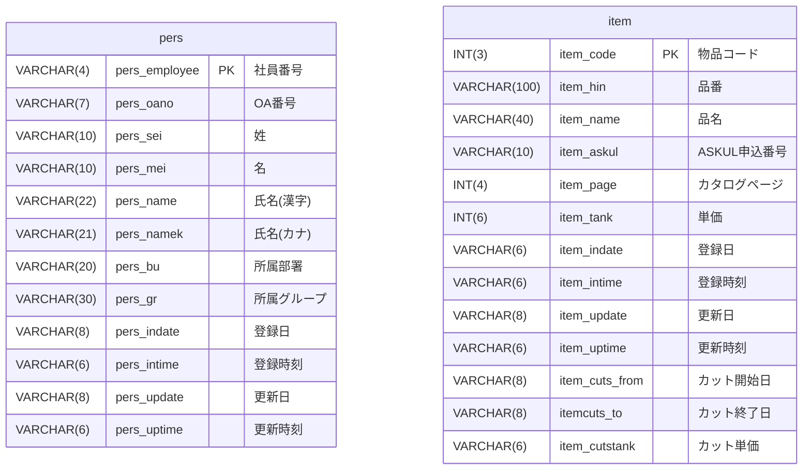
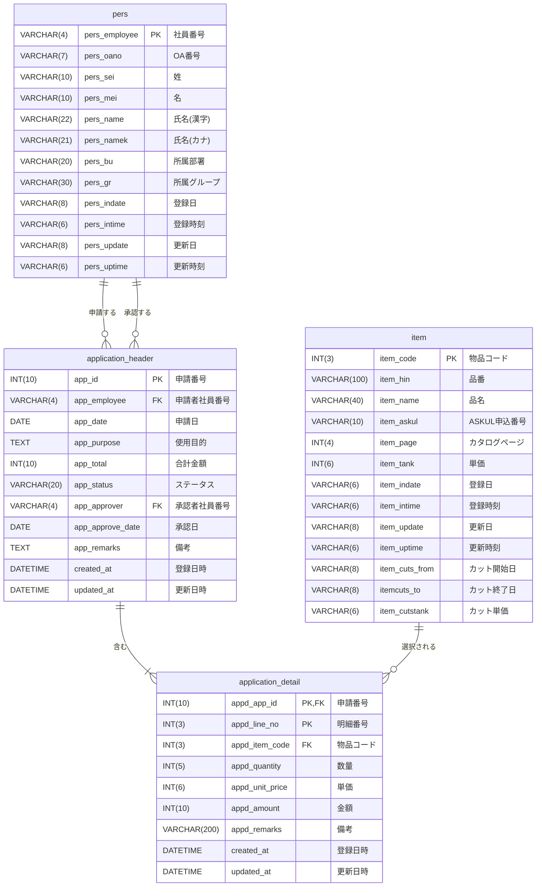
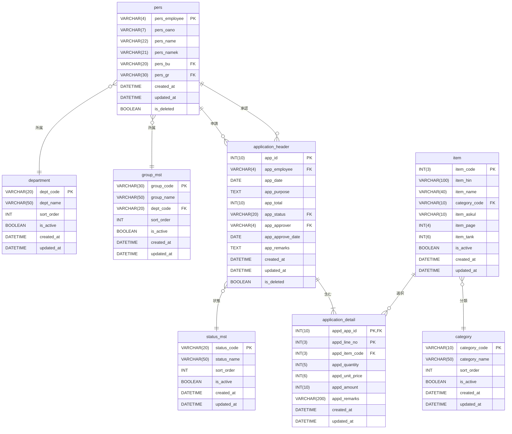

# ER図（Entity Relationship Diagram）

## システム名
物品管理システム

## データベース名
refresh

## 作成日
2025-11-03

---

## 現在実装されているテーブルのER図



**注**: 現在、persテーブルとitemテーブルの間にリレーションシップは存在しません。

---

## 完全なシステムER図（想定）



---

## リレーションシップ詳細

### 1. pers（社員情報） - application_header（購入申請ヘッダ）

#### リレーション1: 申請者
- **種類**: 1対多（One to Many）
- **説明**: 1人の社員は複数の購入申請を作成できる
- **カーディナリティ**: 1 : 0..*
- **外部キー**: application_header.app_employee → pers.pers_employee
- **参照整合性**: CASCADE（社員削除時は論理削除推奨）

#### リレーション2: 承認者
- **種類**: 1対多（One to Many）
- **説明**: 1人の社員は複数の購入申請を承認できる
- **カーディナリティ**: 1 : 0..*
- **外部キー**: application_header.app_approver → pers.pers_employee
- **参照整合性**: CASCADE（社員削除時は論理削除推奨）

---

### 2. application_header（購入申請ヘッダ） - application_detail（購入申請明細）

#### リレーション
- **種類**: 1対多（One to Many）
- **説明**: 1つの購入申請は複数の物品明細を持つ
- **カーディナリティ**: 1 : 1..*（最低1明細は必要）
- **外部キー**: application_detail.appd_app_id → application_header.app_id
- **参照整合性**: CASCADE（ヘッダ削除時に明細も削除）

---

### 3. item（物品マスタ） - application_detail（購入申請明細）

#### リレーション
- **種類**: 1対多（One to Many）
- **説明**: 1つの物品は複数の申請明細で選択される
- **カーディナリティ**: 1 : 0..*
- **外部キー**: application_detail.appd_item_code → item.item_code
- **参照整合性**: RESTRICT（使用中の物品は削除不可）

---

## 拡張ER図（マスタテーブル追加版）



---

## エンティティ詳細

### マスタエンティティ

#### 1. pers（社員情報マスタ）
- **種類**: マスタエンティティ
- **ライフサイクル**: 長期（論理削除）
- **更新頻度**: 低
- **主な用途**: 社員情報管理、申請者・承認者の識別

#### 2. item（物品マスタ）
- **種類**: マスタエンティティ
- **ライフサイクル**: 長期（論理削除）
- **更新頻度**: 中
- **主な用途**: 購入可能物品の管理

#### 3. department（部署マスタ）
- **種類**: マスタエンティティ
- **ライフサイクル**: 長期
- **更新頻度**: 低
- **主な用途**: 組織構造の管理

#### 4. group_mst（グループマスタ）
- **種類**: マスタエンティティ
- **ライフサイクル**: 長期
- **更新頻度**: 低
- **主な用途**: 部署内グループの管理

#### 5. category（カテゴリマスタ）
- **種類**: マスタエンティティ
- **ライフサイクル**: 長期
- **更新頻度**: 低
- **主な用途**: 物品の分類管理

#### 6. status_mst（ステータスマスタ）
- **種類**: マスタエンティティ
- **ライフサイクル**: 長期
- **更新頻度**: 極低
- **主な用途**: 申請ステータスの管理

### トランザクションエンティティ

#### 7. application_header（購入申請ヘッダ）
- **種類**: トランザクションエンティティ
- **ライフサイクル**: 中期（5年保持）
- **更新頻度**: 高
- **主な用途**: 購入申請の基本情報管理

#### 8. application_detail（購入申請明細）
- **種類**: トランザクションエンティティ
- **ライフサイクル**: 中期（5年保持）
- **更新頻度**: 高
- **主な用途**: 購入申請の物品明細管理

---

## 正規化レベル

### 現在の正規化状態

#### persテーブル
- **第1正規形**: ✅ 達成（繰り返し項目なし）
- **第2正規形**: ✅ 達成（部分関数従属性なし）
- **第3正規形**: ❌ 未達成（部署、グループが推移的関数従属）

#### itemテーブル
- **第1正規形**: ✅ 達成
- **第2正規形**: ✅ 達成
- **第3正規形**: ❌ 未達成（カテゴリ情報が含まれる可能性）

### 正規化の改善提案

#### 第3正規形への改善
1. 部署マスタ、グループマスタの分離
2. カテゴリマスタの分離
3. ステータスマスタの分離

これにより：
- データの一貫性向上
- 更新異常の防止
- メンテナンス性の向上

---

## インデックス設計

### 主キーインデックス
- pers.pers_employee
- item.item_code
- application_header.app_id
- application_detail.(appd_app_id, appd_line_no)

### 外部キーインデックス
- application_header.app_employee
- application_header.app_approver
- application_detail.appd_app_id
- application_detail.appd_item_code

### 検索用インデックス
- pers.pers_bu（部署検索）
- pers.pers_gr（グループ検索）
- pers.pers_name（氏名検索）
- item.item_name（物品名検索）
- application_header.app_date（申請日検索）
- application_header.app_status（ステータス検索）

---

## データ整合性制約

### 主キー制約
すべてのテーブルに主キー制約を設定

### 外部キー制約
関連するテーブル間に外部キー制約を設定

### NOT NULL制約
必須項目にNOT NULL制約を設定

### CHECK制約
- app_total >= 0（合計金額は0以上）
- appd_quantity > 0（数量は1以上）
- appd_unit_price >= 0（単価は0以上）

### UNIQUE制約
- pers.pers_oano（OA番号の一意性）
- item.item_askul（ASKUL番号の一意性、NULL許可）

---

## トリガー設計

### 更新日時の自動更新
```sql
CREATE TRIGGER update_timestamp_pers
BEFORE UPDATE ON pers
FOR EACH ROW
SET NEW.updated_at = CURRENT_TIMESTAMP;
```

### 合計金額の自動計算
```sql
CREATE TRIGGER calculate_total
AFTER INSERT OR UPDATE OR DELETE ON application_detail
FOR EACH ROW
UPDATE application_header
SET app_total = (
    SELECT SUM(appd_amount)
    FROM application_detail
    WHERE appd_app_id = NEW.appd_app_id
)
WHERE app_id = NEW.appd_app_id;
```

---

## ビュー設計

### 社員情報ビュー
```sql
CREATE VIEW v_employee_info AS
SELECT
    p.pers_employee,
    p.pers_name,
    p.pers_namek,
    d.dept_name,
    g.group_name
FROM pers p
LEFT JOIN department d ON p.pers_bu = d.dept_code
LEFT JOIN group_mst g ON p.pers_gr = g.group_code
WHERE p.is_deleted = FALSE;
```

### 申請一覧ビュー
```sql
CREATE VIEW v_application_list AS
SELECT
    ah.app_id,
    ah.app_date,
    p1.pers_name AS applicant_name,
    ah.app_purpose,
    ah.app_total,
    s.status_name,
    p2.pers_name AS approver_name,
    ah.app_approve_date
FROM application_header ah
INNER JOIN pers p1 ON ah.app_employee = p1.pers_employee
LEFT JOIN pers p2 ON ah.app_approver = p2.pers_employee
INNER JOIN status_mst s ON ah.app_status = s.status_code
WHERE ah.is_deleted = FALSE;
```

---

## パフォーマンスチューニング

### パーティショニング
大量データが蓄積されるテーブルのパーティショニング検討
- application_header: 申請日でパーティション
- application_detail: 申請番号でパーティション

### クエリ最適化
- EXPLAINを使用したクエリプラン確認
- 適切なインデックスの作成
- 結合順序の最適化

### キャッシュ戦略
- マスタデータのアプリケーションキャッシュ
- クエリ結果のキャッシュ

---

## データマイグレーション

### 既存データの移行
現在のVARCHAR型の日付データをDATE/DATETIME型に変換

```sql
-- 例: pers_indate (VARCHAR) から created_at (DATETIME) への変換
UPDATE pers
SET created_at = STR_TO_DATE(
    CONCAT(pers_indate, pers_intime),
    '%Y%m%d%H%i%s'
);
```

---

## まとめ

このER図は、物品管理システムの現在の状態と将来の拡張を示しています。

### 現状
- 2つの独立したマスタテーブル（pers、item）
- リレーションシップなし
- データ型や正規化に課題あり

### 将来の姿
- 適切な正規化（第3正規形）
- 明確なリレーションシップ
- マスタテーブルの分離
- トランザクションテーブルの追加
- データ整合性の確保

これにより、保守性、拡張性、パフォーマンスが向上します。
