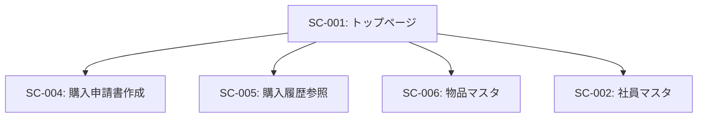

# SC-001: トップページ 画面仕様書

## 基本情報

| 項目 | 内容 |
|------|------|
| 画面ID | SC-001 |
| 画面名 | トップページ |
| 画面種別 | メニュー画面 |
| URL | /index |
| JSPファイル | index.jsp |
| Servletクラス | IndexServlet |
| 実装状況 | ✅ 完成 |
| 作成日 | 2025-11-03 |

---

## 画面概要

### 目的
システムの入口となるメインメニュー画面。ユーザーが利用する各機能へのナビゲーションを提供する。

### 対象ユーザー
- 全社員

### アクセス権限
- なし（現在は認証機能未実装）

---

## 画面レイアウト

### レイアウト構成
```
┌─────────────────────────────────────┐
│           ヘッダー                   │
│   物品管理システム [ナビゲーション]  │
├─────────────────────────────────────┤
│                                     │
│        トップページ                  │
│   ━━━━━━━━━━━━━━━━━━━━━━━         │
│                                     │
│   ┌──────────┐  ┌──────────┐      │
│   │購入申請書 │  │購入履歴   │      │
│   │作成      │  │参照      │      │
│   │          │  │          │      │
│   │[アイコン]│  │[アイコン]│      │
│   └──────────┘  └──────────┘      │
│                                     │
│   ┌──────────┐  ┌──────────┐      │
│   │物品マスタ │  │社員マスタ │      │
│   │          │  │          │      │
│   │[アイコン]│  │[アイコン]│      │
│   └──────────┘  └──────────┘      │
│                                     │
└─────────────────────────────────────┘
```

### デザイン
- **タイルメニュー形式**: 2×2のグリッドレイアウト
- **カラー**:
  - 購入申請書作成: 青色（btn-info）
  - 購入履歴参照: 青色（btn-info）
  - 物品マスタ: 黄色（btn-warning）
  - 社員マスタ: 黄色（btn-warning）
- **サイズ**: 各タイル 240px × 240px
- **アイコン**: Glyphicon（Bootstrap 3）使用

---

## 画面要素

### ヘッダー部
| 要素 | 種類 | 説明 |
|------|------|------|
| システム名 | テキスト | 「物品管理システム」を表示 |
| ナビゲーションバー | メニュー | 共通ヘッダー（header.jsp） |

### メニュータイル

#### 1. 購入申請書作成ボタン
- **表示テキスト**: 購入申請書作成
- **アイコン**: glyphicon-edit
- **ボタンスタイル**: btn-sq-lg btn-info
- **配置**: 左上
- **遷移先**: /applicationForm（SC-004）
- **HTTPメソッド**: GET

#### 2. 購入履歴参照ボタン
- **表示テキスト**: 購入履歴参照
- **アイコン**: glyphicon-book
- **ボタンスタイル**: btn-sq-lg btn-info
- **配置**: 右上
- **遷移先**: /historyView（SC-005）
- **HTTPメソッド**: GET

#### 3. 物品マスタボタン
- **表示テキスト**: 物品マスタ
- **アイコン**: glyphicon-th-list
- **ボタンスタイル**: btn-sq-lg btn-warning
- **配置**: 左下
- **遷移先**: /item（SC-006）
- **HTTPメソッド**: GET

#### 4. 社員マスタボタン
- **表示テキスト**: 社員マスタ
- **アイコン**: glyphicon-user
- **ボタンスタイル**: btn-sq-lg btn-warning
- **配置**: 右下
- **遷移先**: /employee（SC-002）
- **HTTPメソッド**: GET

---

## 画面遷移

### 遷移元
- なし（エントリーポイント）
- 各機能画面からの戻り（想定）

### 遷移先


| 遷移先画面ID | 遷移先画面名 | 遷移条件 |
|-------------|------------|---------|
| SC-002 | 社員マスタ | 社員マスタボタンをクリック |
| SC-004 | 購入申請書作成 | 購入申請書作成ボタンをクリック |
| SC-005 | 購入履歴参照 | 購入履歴参照ボタンをクリック |
| SC-006 | 物品マスタ | 物品マスタボタンをクリック |

---

## 処理フロー

### 画面表示時
```
[開始]
   ↓
1. /index へGETリクエスト
   ↓
2. IndexServlet.doGet() 実行
   ↓
3. index.jsp へフォワード
   ↓
4. ヘッダーを読み込み（header.jsp）
   ↓
5. メニュータイルを表示
   ↓
6. 画面表示完了
   ↓
[終了]
```

### ボタンクリック時
```
[開始]
   ↓
1. ユーザーがいずれかのボタンをクリック
   ↓
2. formのactionに設定されたURLへGETリクエスト
   ↓
3. 対応するServletが起動
   ↓
4. 遷移先画面を表示
   ↓
[終了]
```

---

## 使用技術

### フロントエンド
- **HTML5**
- **CSS3**
- **Bootstrap 3.x**
  - グリッドシステム
  - ボタンコンポーネント
  - Glyphicon
- **jQuery 1.12.4**

### バックエンド
- **Java Servlet API**
- **JSP (JavaServer Pages)**

### レスポンシブ対応
- Bootstrapのグリッドシステム使用
- col-lg-3クラスで4カラムレイアウト
- モバイル、タブレット、デスクトップ対応

---

## セキュリティ

### 現状
- 認証機能なし
- 誰でもアクセス可能

### 改善提案
1. ログイン機能の実装
2. セッション管理
3. 権限チェック
4. 不正アクセス防止

---

## パフォーマンス

### 表示速度
- 静的コンテンツのみ
- データベースアクセスなし
- 高速表示（0.5秒以内）

### 最適化
- CSSの最小化
- JavaScriptの最小化
- 画像の最適化（現在は未使用）

---

## テスト項目

### 表示テスト
- [ ] 画面が正常に表示されること
- [ ] 4つのタイルが正しく配置されること
- [ ] アイコンが正しく表示されること
- [ ] レスポンシブデザインが機能すること

### 遷移テスト
- [ ] 購入申請書作成ボタンで SC-004 へ遷移すること
- [ ] 購入履歴参照ボタンで SC-005 へ遷移すること
- [ ] 物品マスタボタンで SC-006 へ遷移すること
- [ ] 社員マスタボタンで SC-002 へ遷移すること

### ブラウザ互換性テスト
- [ ] Chrome
- [ ] Firefox
- [ ] Safari
- [ ] Edge
- [ ] IE11（必要に応じて）

### レスポンシブテスト
- [ ] デスクトップ（1920×1080）
- [ ] タブレット（768×1024）
- [ ] スマートフォン（375×667）

---

## ソースコード

### Servletクラス
```
パス: src/servlet/IndexServlet.java
機能: index.jspへのフォワードのみ
```

### JSPファイル
```
パス: WebContent/index.jsp
機能: メニュー画面の表示
```

### 関連ファイル
```
WebContent/components/header.jsp: 共通ヘッダー
WebContent/css/bootstrap.min.css: Bootstrap CSS
WebContent/css/base.css: カスタムCSS
WebContent/js/jquery-1.12.4.min.js: jQuery
WebContent/js/bootstrap.min.js: Bootstrap JS
```

---

## 改善提案

### 短期改善（1-3ヶ月）
1. **ログイン機能の追加**
   - 認証画面の実装
   - セッション管理

2. **ブレッドクラム追加**
   - ナビゲーション履歴の表示

3. **お知らせ機能**
   - システムからの通知表示エリア

### 中期改善（3-6ヶ月）
1. **ダッシュボード化**
   - 申請件数の表示
   - 承認待ち件数の表示
   - グラフやチャートの追加

2. **権限による表示制御**
   - ユーザー権限に応じたメニュー表示

3. **検索機能**
   - トップページからの統合検索

### 長期改善（6ヶ月以降）
1. **パーソナライゼーション**
   - ユーザーごとのカスタマイズ
   - よく使う機能の優先表示

2. **ウィジェット化**
   - ドラッグ&ドロップでレイアウト変更
   - 必要な情報だけを表示

---

## 関連ドキュメント

- [画面一覧](../screen_list.md)
- [機能一覧](../function_list.md): F-003（メニュー表示機能）
- [業務一覧](../business_process_list.md)

---

## 変更履歴

| 日付 | バージョン | 変更内容 | 担当者 |
|------|-----------|---------|--------|
| 2025-11-03 | 1.0 | 初版作成 | - |

---

## 承認

| 役割 | 氏名 | 承認日 |
|------|------|--------|
| 作成者 | | 2025-11-03 |
| レビュー担当 | | |
| 承認者 | | |
