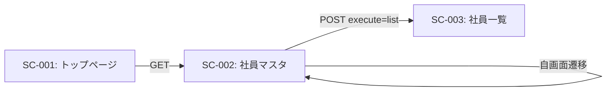

# SC-002: 社員マスタ 画面仕様書

## 基本情報

| 項目 | 内容 |
|------|------|
| 画面ID | SC-002 |
| 画面名 | 社員マスタ |
| 画面種別 | 入力画面（CRUD） |
| URL | /employee |
| JSPファイル | employeeMst.jsp |
| Servletクラス | EmployeeMstServlet |
| BLクラス | EmployeeMstBL |
| DAOクラス | EmployeeDAO |
| DTOクラス | Employee |
| Formクラス | EmployeeForm |
| 実装状況 | ✅ 完成 |
| 作成日 | 2025-11-03 |

---

## 画面概要

### 目的
社員情報の登録、更新、削除、検索機能を提供する。人事担当者が社員の基本情報を管理するための画面。

### 対象ユーザー
- 人事担当者
- システム管理者

### アクセス権限
- 現在は未実装（今後、人事権限チェックを追加予定）

---

## 画面レイアウト

### レイアウト構成
```
┌─────────────────────────────────────┐
│           ヘッダー                   │
│   物品管理システム [ナビゲーション]  │
├─────────────────────────────────────┤
│   社員マスタ                         │
│   ━━━━━━━━━━━━━━━━━━━━━━━         │
│                                     │
│   ┌──────────────────┐             │
│   │[情報メッセージ]   │             │
│   │ ✓ 登録に成功しました │            │
│   └──────────────────┘             │
│                                     │
│   ┌──────────────────┐             │
│   │[エラーメッセージ]  │             │
│   │ ⚠ 入力エラーがあります│            │
│   └──────────────────┘             │
│                                     │
│   [一覧表示] ← ボタン                │
│                                     │
│   社員 - 選択                        │
│   [▼ 選択してください ▼]            │
│                                     │
│   社員番号                           │
│   [_________]                       │
│                                     │
│   OA番号                            │
│   [_________]                       │
│                                     │
│   氏名（漢字）        氏名（カナ）   │
│   [_________]         [_________]   │
│                                     │
│   部署                所属グループ   │
│   [▼選択▼]           [▼選択▼]     │
│                                     │
│   [登録する] または                  │
│   [更新する] [削除する]              │
│                                     │
└─────────────────────────────────────┘
```

---

## 画面要素詳細

### メッセージエリア

#### 情報メッセージ
- **表示位置**: 画面上部
- **スタイル**: alert-success（緑色）
- **表示条件**: 処理成功時
- **メッセージ例**:
  - 「社員情報の登録に成功しました。」
  - 「社員情報の更新に成功しました。」
  - 「社員情報の削除に成功しました。」
- **閉じるボタン**: あり（×）

#### エラーメッセージ
- **表示位置**: 画面上部
- **スタイル**: alert-warning（黄色）
- **表示条件**: バリデーションエラー、処理失敗時
- **メッセージ例**:
  - 「社員番号は必須で4文字以内で入力してください。」
  - 「入力した社員番号はすでに登録されています。」
  - 「DB接続時に予期せぬエラーが発生しました。」
- **閉じるボタン**: あり（×）

### 操作ボタンエリア

#### 一覧表示ボタン
- **表示テキスト**: 一覧表示
- **ボタンスタイル**: btn-info
- **機能**: 社員一覧画面（SC-003）へ遷移
- **HTTPメソッド**: POST
- **executeパラメータ**: list

### 検索エリア

#### 社員選択ドロップダウン
- **項目ID**: employeeName
- **ラベル**: 社員 - 選択
- **種類**: select（ドロップダウン）
- **初期値**: "--- 社員を選択 ---"
- **選択肢**: データベースから取得した社員リスト（社員番号 + 氏名）
- **イベント**: onChange時にJavaScriptでフォーム送信
- **機能**: 選択した社員情報を画面に表示

### 入力エリア

#### 社員番号
| 項目 | 内容 |
|------|------|
| 項目ID | employeeId |
| ラベル | 社員番号 |
| 種類 | text |
| 必須 | ○ |
| 最大桁数 | 4桁 |
| 形式 | 半角数字のみ |
| プレースホルダー | 例）0343 |
| 制約 | 新規登録時のみ入力可能、更新時はdisabled |
| バリデーション | 必須、半角数字4桁、重複チェック |

#### OA番号
| 項目 | 内容 |
|------|------|
| 項目ID | oano |
| ラベル | OA番号 |
| 種類 | text |
| 必須 | ○ |
| 最大桁数 | 7桁 |
| 形式 | 半角数字のみ |
| プレースホルダー | 例）0250417 |
| バリデーション | 必須、半角数字7桁 |

#### 氏名（漢字）
| 項目 | 内容 |
|------|------|
| 項目ID | employeeNameKanji |
| ラベル | 氏名（漢字） |
| 種類 | text |
| 必須 | ○ |
| 最大桁数 | 全角11文字（22バイト） |
| 形式 | 全角文字 |
| プレースホルダー | 例）山田　太郎 |
| バリデーション | 必須、全角11文字以内 |

#### 氏名（カナ）
| 項目 | 内容 |
|------|------|
| 項目ID | employeeNameKana |
| ラベル | 氏名（カナ） |
| 種類 | text |
| 必須 | ○ |
| 最大桁数 | 半角21文字 |
| 形式 | 半角カタカナ推奨 |
| プレースホルダー | 例）ヤマダ　タロウ |
| バリデーション | 必須、半角21文字以内 |

#### 部署
| 項目 | 内容 |
|------|------|
| 項目ID | department |
| ラベル | 部署 |
| 種類 | select（ドロップダウン） |
| 必須 | ○ |
| 選択肢 | ・システム開発部<br>・ラボシステム部<br>・システム管理部 |
| 初期値 | 先頭の選択肢 |
| バリデーション | 必須 |

#### 所属グループ
| 項目 | 内容 |
|------|------|
| 項目ID | group |
| ラベル | 所属グループ |
| 種類 | select（ドロップダウン） |
| 必須 | ○ |
| 選択肢 | ・SIG<br>・運用G |
| 初期値 | 先頭の選択肢 |
| バリデーション | 必須 |

### 実行ボタンエリア

#### 登録するボタン（新規登録時）
- **表示テキスト**: 登録する
- **ボタンスタイル**: btn-primary（青）
- **表示条件**: 新規入力時（editFlgがfalseまたは未設定）
- **HTTPメソッド**: POST
- **executeパラメータ**: register
- **処理**: 社員情報をデータベースに新規登録

#### 更新するボタン（更新時）
- **表示テキスト**: 更新する
- **ボタンスタイル**: btn-primary（青）
- **表示条件**: 社員選択後（editFlgがtrue）
- **HTTPメソッド**: POST
- **executeパラメータ**: update
- **onClick**: unDisabled()関数を実行（社員番号のdisabledを解除）
- **処理**: 社員情報をデータベースで更新

#### 削除するボタン（更新時）
- **表示テキスト**: 削除する
- **ボタンスタイル**: btn-danger（赤）
- **表示条件**: 社員選択後（editFlgがtrue）
- **HTTPメソッド**: POST
- **executeパラメータ**: delete
- **onClick**: unDisabled()関数を実行（社員番号のdisabledを解除）
- **処理**: 社員情報をデータベースから削除

---

## 画面遷移

### 遷移元
- SC-001（トップページ）: 社員マスタボタンをクリック

### 遷移先
- SC-003（社員マスタ一覧）: 一覧表示ボタンをクリック

### 遷移図


---

## 処理フロー

### 初期表示（GET）
```
[開始]
   ↓
1. /employee へGETリクエスト
   ↓
2. EmployeeMstServlet.doGet() 実行
   ↓
3. 文字エンコーディングをUTF-8に設定
   ↓
4. EmployeeMstBL、EmployeeFormをインスタンス化
   ↓
5. コンボボックスのデータ取得
   - 社員一覧（EmployeeMstBL.searchEmpolyees()）
   - 部署リスト（EmployeeForm.getDepartmentList()）
   - グループリスト（EmployeeForm.getGroupList()）
   ↓
6. フォームを空で初期化
   - 全項目を空文字列に設定
   ↓
7. データをRequestに設定
   ↓
8. employeeMst.jsp へフォワード
   ↓
9. 画面表示
   ↓
[終了]
```

### 社員選択（POST - select）
```
[開始]
   ↓
1. 社員選択ドロップダウンで社員を選択
   ↓
2. JavaScript（getList関数）でフォーム送信
   - execute=select をパラメータに追加
   ↓
3. EmployeeMstServlet.doPost() 実行
   ↓
4. executeパラメータを取得 → "select"
   ↓
5. employeeNameパラメータから社員番号を抽出
   ↓
6. EmployeeMstBL.searchEmpolyeeById() で社員情報を取得
   ↓
7. エラーチェック
   ├→ エラーあり: エラーメッセージ設定
   └→ エラーなし: 取得した社員情報をRequestに設定
   ↓
8. editFlg=true を設定（更新・削除ボタン表示用）
   ↓
9. コンボボックスを再初期化
   ↓
10. employeeMst.jsp へフォワード
   ↓
11. 社員情報が入力された状態で画面表示
   ↓
[終了]
```

### 新規登録（POST - register）
```
[開始]
   ↓
1. 全項目に値を入力
   ↓
2. 「登録する」ボタンをクリック
   ↓
3. EmployeeMstServlet.doPost() 実行
   ↓
4. executeパラメータを取得 → "register"
   ↓
5. 入力値をEmployeeFormに設定
   - setEmployeeForm()メソッド
   ↓
6. バリデーション実行
   - EmployeeForm.validateInputData()
   ├→ エラーあり: エラーメッセージ設定 → 9へ
   └→ エラーなし: 次へ
   ↓
7. EmployeeMstBL.registerEmpolyee() でDB登録
   ├→ 失敗: エラーメッセージ設定 → 9へ
   └→ 成功: 情報メッセージ設定
   ↓
8. フォームを初期化
   ↓
9. コンボボックスを再初期化
   ↓
10. employeeMst.jsp へフォワード
   ↓
11. 結果メッセージと共に画面表示
   ↓
[終了]
```

### 更新（POST - update）
```
[開始]
   ↓
1. 社員選択で対象社員を表示
   ↓
2. 修正する項目の値を変更
   ↓
3. 「更新する」ボタンをクリック
   ↓
4. JavaScript（unDisabled関数）で社員番号のdisabledを解除
   ↓
5. EmployeeMstServlet.doPost() 実行
   ↓
6. executeパラメータを取得 → "update"
   ↓
7. 入力値をEmployeeFormに設定
   ↓
8. バリデーション実行
   ├→ エラーあり:
   │   - エラーメッセージ設定
   │   - editFlg=true 設定
   │   → 11へ
   └→ エラーなし: 次へ
   ↓
9. EmployeeMstBL.updateEmpolyee() でDB更新
   ├→ 失敗:
   │   - エラーメッセージ設定
   │   - editFlg=true 設定
   │   → 11へ
   └→ 成功: 情報メッセージ設定
   ↓
10. フォームを初期化
   ↓
11. コンボボックスを再初期化
   ↓
12. employeeMst.jsp へフォワード
   ↓
13. 結果メッセージと共に画面表示
   ↓
[終了]
```

### 削除（POST - delete）
```
[開始]
   ↓
1. 社員選択で対象社員を表示
   ↓
2. 「削除する」ボタンをクリック
   ↓
3. JavaScript（unDisabled関数）で社員番号のdisabledを解除
   ↓
4. EmployeeMstServlet.doPost() 実行
   ↓
5. executeパラメータを取得 → "delete"
   ↓
6. 入力値をEmployeeFormに設定
   ↓
7. EmployeeMstBL.deleteEmpolyee() でDB削除
   ├→ 失敗:
   │   - エラーメッセージ設定
   │   - editFlg=true 設定
   │   → 9へ
   └→ 成功: 情報メッセージ設定
   ↓
8. フォームを初期化
   ↓
9. コンボボックスを再初期化
   ↓
10. employeeMst.jsp へフォワード
   ↓
11. 結果メッセージと共に画面表示
   ↓
[終了]
```

### 一覧表示（POST - list）
```
[開始]
   ↓
1. 「一覧表示」ボタンをクリック
   ↓
2. EmployeeMstServlet.doPost() 実行
   ↓
3. executeパラメータを取得 → "list"
   ↓
4. EmployeeMstBL.searchAllEmpolyees() で全社員情報を取得
   ↓
5. 社員リストをRequestに設定
   ↓
6. employeeMstList.jsp へフォワード
   ↓
7. 社員一覧画面（SC-003）を表示
   ↓
[終了]
```

---

## バリデーション

### バリデーションルール

| 項目 | チェック内容 | エラーメッセージ |
|------|------------|----------------|
| 社員番号 | 必須 | 社員番号は必須です |
| 社員番号 | 半角数字 | 社員番号は数字で入力してください |
| 社員番号 | 4桁以内 | 社員番号は半角4文字以内で入力してください |
| 社員番号 | 重複チェック | 入力した社員番号はすでに登録されています |
| OA番号 | 必須 | OA番号は必須です |
| OA番号 | 半角数字 | OA番号は数値で入力してください |
| OA番号 | 7桁以内 | OA番号は半角7文字以内で入力してください |
| 氏名（漢字） | 必須 | 氏名（漢字）は必須です |
| 氏名（漢字） | 11文字以内 | 氏名（漢字）は全角11文字以内で入力してください |
| 氏名（カナ） | 必須 | 氏名（カナ）は必須です |
| 氏名（カナ） | 21文字以内 | 氏名（カナ）は半角21文字以内で入力してください |
| 部署 | 必須 | 部署は必須です |
| 部署 | 10文字以内 | 部署は全角10文字以内で入力してください |
| グループ | 必須 | グループは必須です |
| グループ | 15文字以内 | グループ名は全角15文字以内で入力してください |

### バリデーション実行タイミング
- **サーバーサイド**: 登録・更新ボタンクリック時（POST送信後）
- **クライアントサイド**: 現在未実装（今後の改善課題）

### バリデーション実装場所
- **Formクラス**: EmployeeForm.validateInputData()
- **Validatorクラス**: BaseValidator（checkByte、isNumberメソッド）

---

## データベース操作

### 使用テーブル
- **pers**（社員情報マスタ）

### 操作種別

#### SELECT（検索）
- **メソッド**: EmployeeDAO.searchEmpolyees()
  - 全社員の社員番号と氏名を取得（ドロップダウン用）
- **メソッド**: EmployeeDAO.searchAllEmpolyees()
  - 全社員の全情報を取得（一覧表示用）
- **メソッド**: EmployeeDAO.searchEmpolyeeById()
  - 特定社員の全情報を取得（詳細表示用）

#### INSERT（登録）
- **メソッド**: EmployeeDAO.registerEmployee()
- **SQL**:
  ```sql
  INSERT INTO pers (pers_employee, pers_oano, pers_sei, pers_mei,
                    pers_name, pers_namek, pers_bu, pers_gr,
                    pers_indate, pers_intime)
  VALUES (?, ?, ?, ?, ?, ?, ?, ?, ?, ?)
  ```
- **登録日時**: 自動設定（LocalDateTime.now()）

#### UPDATE（更新）
- **メソッド**: EmployeeDAO.updateEmployee()
- **SQL**:
  ```sql
  UPDATE pers SET pers_oano = ?, pers_sei = ?, pers_mei = ?,
                  pers_name = ?, pers_namek = ?, pers_bu = ?, pers_gr = ?,
                  pers_update = ?, pers_uptime = ?
  WHERE pers_employee = ?
  ```
- **更新日時**: 自動設定（LocalDateTime.now()）

#### DELETE（削除）
- **メソッド**: EmployeeDAO.deleteEmployee()
- **SQL**:
  ```sql
  DELETE FROM pers WHERE pers_employee = ?
  ```
- **削除方法**: 物理削除（レコードを完全削除）

---

## JavaScript

### getList関数
```javascript
function getList() {
    var form = this.document.forms.form1;
    var input = this.document.createElement('input');
    input.setAttribute('name', 'execute');
    input.setAttribute('value', 'select');
    form.appendChild(input);
    form.submit();
}
```
- **機能**: 社員選択時に自動でフォーム送信
- **トリガー**: 社員選択ドロップダウンのonChangeイベント

### unDisabled関数
```javascript
function unDisabled() {
    document.getElementById("employeeId").disabled = false;
    return true;
}
```
- **機能**: 社員番号フィールドのdisabledを一時解除
- **トリガー**: 更新・削除ボタンのonClickイベント
- **目的**: 更新・削除時にPOSTパラメータに社員番号を含める

---

## セキュリティ

### 現状の対策
- **SQLインジェクション対策**: PreparedStatementを使用
- **文字エンコーディング**: UTF-8に統一

### 未実装の対策
- **認証・認可**: ログイン機能未実装
- **XSS対策**: 入力値のエスケープ処理が不十分
- **CSRF対策**: トークンチェックなし
- **削除確認**: 削除前の確認ダイアログなし

### 改善提案
1. ログイン機能の実装
2. 権限チェックの追加（人事権限のみ操作可能）
3. CSRF対策トークンの実装
4. 削除前の確認ダイアログ追加
5. 入力値のサニタイズ強化

---

## テスト項目

### 表示テスト
- [ ] 初期表示で空のフォームが表示されること
- [ ] コンボボックスにデータが正しく表示されること
- [ ] レスポンシブデザインが機能すること

### 社員選択テスト
- [ ] 社員選択で該当社員情報が表示されること
- [ ] 社員選択後、更新・削除ボタンが表示されること
- [ ] 社員番号フィールドがdisabledになること

### 登録機能テスト
- [ ] 正常な入力で登録が成功すること
- [ ] 重複する社員番号で登録がエラーになること
- [ ] 必須チェックが機能すること
- [ ] 桁数チェックが機能すること
- [ ] 数値チェックが機能すること
- [ ] 成功メッセージが表示されること
- [ ] 登録後フォームがクリアされること

### 更新機能テスト
- [ ] 正常な入力で更新が成功すること
- [ ] 社員番号は変更できないこと
- [ ] バリデーションエラーで更新が失敗すること
- [ ] 成功メッセージが表示されること
- [ ] 更新後フォームがクリアされること

### 削除機能テスト
- [ ] 削除が成功すること
- [ ] 削除後、該当社員がドロップダウンから消えること
- [ ] 成功メッセージが表示されること
- [ ] 削除後フォームがクリアされること

### 一覧表示テスト
- [ ] 一覧画面へ正常に遷移すること

### エラーハンドリングテスト
- [ ] DB接続エラー時に適切なエラーメッセージが表示されること
- [ ] バリデーションエラー時に入力値が保持されること

---

## パフォーマンス

### レスポンス時間目標
- 初期表示: 1秒以内
- 登録処理: 0.5秒以内
- 更新処理: 0.5秒以内
- 削除処理: 0.5秒以内
- 検索処理: 0.5秒以内

### 最適化ポイント
- コンボボックスデータのキャッシュ（現在は毎回DB取得）
- インデックスの適切な設定
- 不要なデータ取得の削減

---

## ソースコード

### 関連ファイル

| 種類 | ファイルパス | 説明 |
|------|------------|------|
| Servlet | src/servlet/EmployeeMstServlet.java | プレゼンテーション層 |
| BL | src/bl/EmployeeMstBL.java | ビジネスロジック層 |
| DAO | src/dao/EmployeeDAO.java | データアクセス層 |
| DTO | src/dto/Employee.java | データ転送オブジェクト |
| Form | src/form/EmployeeForm.java | フォームクラス（バリデーション） |
| Validator | src/validator/BaseValidator.java | 基底バリデータクラス |
| JSP | WebContent/employeeMst.jsp | 画面表示 |
| Header | WebContent/components/header.jsp | 共通ヘッダー |

---

## 改善提案

### 短期改善（1-3ヶ月）
1. **削除確認ダイアログの追加**
   - JavaScriptでconfirm実装
   - 誤削除防止

2. **クライアントサイドバリデーション**
   - jQuery Validationの導入
   - リアルタイムエラー表示

3. **論理削除への変更**
   - 物理削除から論理削除へ
   - is_deletedフラグの追加

### 中期改善（3-6ヶ月）
1. **検索機能の追加**
   - 部署での絞り込み
   - 氏名での部分一致検索
   - グループでの絞り込み

2. **ページネーション**
   - 大量データ対応
   - 表示件数の選択

3. **一括操作機能**
   - CSVインポート
   - CSVエクスポート
   - 一括更新

### 長期改善（6ヶ月以降）
1. **履歴管理**
   - 変更履歴の記録
   - 監査ログ

2. **権限管理との連携**
   - 人事権限チェック
   - 承認フロー

3. **API化**
   - RESTful APIの提供
   - 他システムとの連携

---

## 関連ドキュメント

- [画面一覧](../screen_list.md)
- [テーブル一覧](../table_list.md): persテーブル
- [機能一覧](../function_list.md): F-101～F-105
- [業務一覧](../business_process_list.md): B-001～B-004
- [Servlet仕様書](../specs/EmployeeMstServlet_spec.md)
- [BL仕様書](../specs/EmployeeMstBL_spec.md)
- [DAO仕様書](../specs/EmployeeDAO_spec.md)

---

## 変更履歴

| 日付 | バージョン | 変更内容 | 担当者 |
|------|-----------|---------|--------|
| 2025-11-03 | 1.0 | 初版作成 | - |

---

## 承認

| 役割 | 氏名 | 承認日 |
|------|------|--------|
| 作成者 | | 2025-11-03 |
| レビュー担当 | | |
| 承認者 | | |
