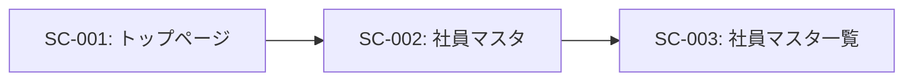
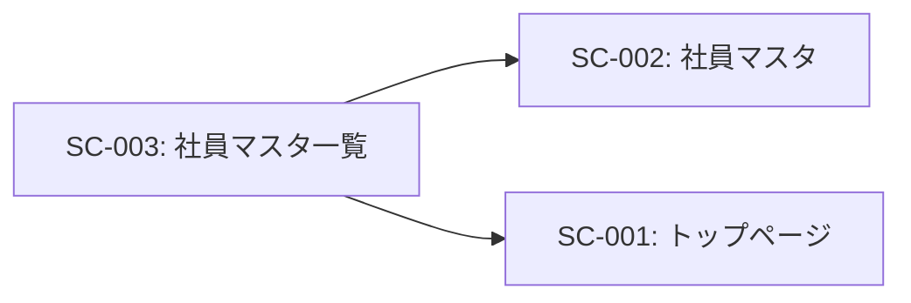

# SC-003: 社員マスタ一覧 画面仕様書

## 基本情報

| 項目 | 内容 |
|------|------|
| 画面ID | SC-003 |
| 画面名 | 社員マスタ一覧 |
| 画面種別 | 一覧表示画面 |
| URL | /employee (execute=list) |
| JSPファイル | employeeMstList.jsp |
| Servletクラス | EmployeeMstServlet |
| 実装状況 | ✅ 完成 |
| 作成日 | 2025-11-03 |

---

## 画面概要

### 目的
登録されている全社員の一覧を表形式で表示する。社員情報の閲覧、検索、一覧表示を行う。

### 対象ユーザー
- 全社員
- 人事担当者
- システム管理者

### アクセス権限
- なし（現在は認証機能未実装）

---

## 画面レイアウト

### レイアウト構成
```
┌─────────────────────────────────────────────┐
│           ヘッダー                            │
│   物品管理システム [ナビゲーション]            │
├─────────────────────────────────────────────┤
│                                              │
│        社員マスタ                             │
│   ━━━━━━━━━━━━━━━━━━━━━━━━━━━━━━         │
│                                              │
│   物品一覧                                    │
│   ┌───────────────────────────────────┐     │
│   │社員番号│OA番号│氏名(漢字)│氏名(カナ)│    │
│   │       │      │部署     │所属グループ│    │
│   ├───────────────────────────────────┤     │
│   │0001   │1234567│山田太郎 │ヤマダタロウ│    │
│   │0002   │1234568│佐藤花子 │サトウハナコ│    │
│   │...    │...    │...      │...        │    │
│   └───────────────────────────────────┘     │
│                                              │
└─────────────────────────────────────────────┘
```

### デザイン
- **テーブルスタイル**: Bootstrap 3の`.table`クラス使用
  - `.table-striped`: 行ごとに交互に背景色を変更
  - `.table-hover`: マウスホバー時にハイライト
  - `.table-bordered`: 全セルに境界線
- **レスポンシブ対応**: col-lg-12で全幅使用
- **アイコン**: glyphicon-user（ヘッダー部）

---

## 画面要素

### ヘッダー部
| 要素 | 種類 | 説明 |
|------|------|------|
| システム名 | テキスト | 「物品管理システム」を表示 |
| ナビゲーションバー | メニュー | 共通ヘッダー（header.jsp） |
| 画面タイトル | h3 | 「社員マスタ」とアイコン表示 |

### 一覧テーブル

#### テーブル構成
| カラム名 | データ型 | 説明 | 幅 |
|---------|---------|------|-----|
| 社員番号 | VARCHAR(4) | 従業員の識別番号 | 自動 |
| OA番号 | VARCHAR(7) | オフィスオートメーション番号 | 自動 |
| 氏名（漢字） | VARCHAR(22) | 社員の氏名（漢字表記） | 自動 |
| 氏名（カナ） | VARCHAR(50) | 社員の氏名（カナ表記） | 自動 |
| 部署 | VARCHAR(50) | 所属部署名 | 自動 |
| 所属グループ | VARCHAR(50) | 所属グループ名 | 自動 |

#### データソース
- **変数名**: `employeeList`
- **型**: `List<Employee>`
- **スコープ**: request
- **取得元**: EmployeeMstServlet → EmployeeMstBL → EmployeeDAO

---

## 画面遷移

### 遷移元


| 遷移元画面ID | 遷移元画面名 | 遷移条件 |
|-------------|------------|---------|
| SC-002 | 社員マスタ | 「一覧表示」ボタンをクリック |

### 遷移先


| 遷移先画面ID | 遷移先画面名 | 遷移条件 |
|-------------|------------|---------|
| SC-002 | 社員マスタ | ヘッダーの「社員マスタ」をクリック |
| SC-001 | トップページ | ヘッダーの「TOP」をクリック |

---

## 処理フロー

### 画面表示時（一覧表示）
```
[開始]
   ↓
1. SC-002で「一覧表示」ボタンをクリック
   ↓
2. /employee へPOSTリクエスト（execute=list）
   ↓
3. EmployeeMstServlet.doPost() 実行
   ↓
4. execute パラメータを取得
   ↓
5. "list" の場合の処理実行
   ↓
6. EmployeeMstBL.getEmployeeList() 呼び出し
   ↓
7. EmployeeDAO.selectAll() 実行
   ↓
8. データベースから全社員データを取得
   SELECT * FROM refresh.pers ORDER BY pers_employee
   ↓
9. ResultSetをList<Employee>に変換
   ↓
10. リストをrequestスコープに設定
    request.setAttribute("employeeList", employeeList)
   ↓
11. employeeMstList.jsp へフォワード
   ↓
12. JSTLのc:forEachでemployeeListをループ
   ↓
13. 各Employeeオブジェクトのプロパティを表示
    - employee.employee → 社員番号
    - employee.oano → OA番号
    - employee.nameKanji → 氏名（漢字）
    - employee.namekana → 氏名（カナ）
    - employee.department → 部署
    - employee.group → 所属グループ
   ↓
14. 画面表示完了
   ↓
[終了]
```

---

## データフロー

### バックエンド処理
```
[EmployeeMstServlet]
   ↓
1. doPost()メソッド実行
2. execute = "list" を検出
3. EmployeeMstBL インスタンス生成
   ↓
[EmployeeMstBL]
   ↓
4. getEmployeeList() メソッド実行
5. ConnectionManager.getConnection() で接続取得
6. EmployeeDAO インスタンス生成
7. employeeDAO.selectAll(conn) 呼び出し
   ↓
[EmployeeDAO]
   ↓
8. selectAll() メソッド実行
9. SQL実行: SELECT * FROM refresh.pers ORDER BY pers_employee
10. ResultSetからEmployeeオブジェクト生成
    - rs.getString("pers_employee") → employee
    - rs.getString("pers_oano") → oano
    - rs.getString("pers_name") → nameKanji
    - rs.getString("pers_namekana") → namekana
    - rs.getString("pers_department") → department
    - rs.getString("pers_group") → group
    - ... (他のフィールドも同様)
11. List<Employee>に追加
   ↓
[EmployeeMstBL]
   ↓
12. リストを受け取り
13. データベース接続をクローズ
14. リストをServletに返却
   ↓
[EmployeeMstServlet]
   ↓
15. request.setAttribute("employeeList", employeeList)
16. employeeMstList.jsp へフォワード
```

### フロントエンド処理
```
[employeeMstList.jsp]
   ↓
1. requestスコープからemployeeListを取得
   ↓
2. <c:forEach items="${employeeList}" var="employee">
   ↓
3. 各employeeオブジェクトに対して：
   - <c:out value="${employee.employee}" />
   - <c:out value="${employee.oano}" />
   - <c:out value="${employee.nameKanji}" />
   - <c:out value="${employee.namekana}" />
   - <c:out value="${employee.department}" />
   - <c:out value="${employee.group}" />
   ↓
4. テーブル行として出力
   ↓
5. 次のemployeeオブジェクトへ（forEachループ）
   ↓
6. すべてのデータ表示完了
```

---

## データベース操作

### 使用テーブル
- **テーブル名**: `refresh.pers`
- **操作**: SELECT（読み取りのみ）

### SQL文
```sql
-- 全社員情報取得
SELECT
    pers_employee,
    pers_oano,
    pers_name,
    pers_namekana,
    pers_department,
    pers_group,
    pers_position,
    pers_division,
    pers_team,
    pers_email,
    pers_tel,
    pers_flg
FROM refresh.pers
ORDER BY pers_employee;
```

### データマッピング
| データベースカラム | Javaプロパティ | 画面表示 |
|------------------|---------------|---------|
| pers_employee | employee | 社員番号 |
| pers_oano | oano | OA番号 |
| pers_name | nameKanji | 氏名（漢字） |
| pers_namekana | namekana | 氏名（カナ） |
| pers_department | department | 部署 |
| pers_group | group | 所属グループ |

---

## JavaScript

### 関数一覧

#### getList()
```javascript
function getList() {
    var form = this.document.forms.form1;
    var input = this.document.createElement('input');
    input.setAttribute('name', 'execute');
    input.setAttribute('value', 'select');
    form.appendChild(input);
    form.submit();
}
```

**説明**: コンボボックス選択時に特定社員情報を取得するための関数（現在の画面では未使用）

**用途**: SC-002（社員マスタ編集画面）で使用されるため、共通のJavaScriptとして定義

---

## 使用技術

### フロントエンド
- **HTML5**
- **CSS3**
- **Bootstrap 3.x**
  - テーブルコンポーネント
  - グリッドシステム
  - Glyphicon
- **jQuery 1.12.4**
- **JSTL (JSP Standard Tag Library)**
  - `<c:forEach>` - リスト反復処理
  - `<c:out>` - XSS対策のエスケープ出力

### バックエンド
- **Java Servlet API**
- **JSP (JavaServer Pages)**
- **JDBC (Java Database Connectivity)**
- **MySQL**

---

## セキュリティ

### XSS対策
- **実装済み**: `<c:out>` タグによる自動エスケープ
  ```jsp
  <c:out value="${employee.nameKanji}" />
  ```
- すべての出力値に適用
- HTMLタグやJavaScriptコードの注入を防止

### SQL Injection対策
- **実装済み**: PreparedStatementの使用（EmployeeDAO）
- パラメータバインディングで安全なSQL実行

### セッション管理
- **未実装**: 認証・認可機能なし
- **リスク**: 誰でもアクセス可能

### 改善提案
1. **アクセス制御**
   - ログイン機能の実装
   - セッション管理
   - 権限チェック（人事担当者のみアクセス可能）

2. **個人情報保護**
   - アクセスログの記録
   - データマスキング（必要に応じて）
   - HTTPS通信の強制

---

## パフォーマンス

### 現状の性能
- **データ取得**: 1回のSELECT文で全データ取得
- **レンダリング**: サーバーサイドでHTMLを生成
- **想定表示時間**:
  - 100件未満: 1秒以内
  - 100-500件: 1-3秒
  - 500件以上: 3秒以上

### パフォーマンスの懸念
1. **全件取得**
   - 社員数が増加すると応答時間が増加
   - メモリ使用量の増加

2. **ページネーションなし**
   - 大量データの一括表示
   - ブラウザのレンダリング負荷

3. **検索・フィルタリング機能なし**
   - 全データを毎回表示

### 最適化提案

#### 短期（1-2ヶ月）
1. **ページネーション実装**
   ```sql
   SELECT * FROM refresh.pers
   ORDER BY pers_employee
   LIMIT 20 OFFSET 0;  -- 20件ずつ表示
   ```

2. **インデックスの追加**
   ```sql
   CREATE INDEX idx_pers_employee ON refresh.pers(pers_employee);
   CREATE INDEX idx_pers_department ON refresh.pers(pers_department);
   ```

#### 中期（3-6ヶ月）
1. **検索機能の追加**
   - 社員番号検索
   - 氏名検索（前方一致、部分一致）
   - 部署フィルタリング

2. **ソート機能**
   - 各カラムのクリックでソート
   - 昇順・降順の切り替え

3. **件数表示**
   - 「全XX件中XX-XX件を表示」

#### 長期（6ヶ月以降）
1. **非同期データ読み込み**
   - Ajax + JSON APIでデータ取得
   - クライアントサイドレンダリング

2. **キャッシング**
   - サーバーサイドキャッシュ
   - ブラウザキャッシュの活用

3. **仮想スクロール**
   - 表示領域のみをレンダリング
   - スクロール時に動的にロード

---

## エラーハンドリング

### 想定エラー

#### 1. データ取得エラー
**原因**: データベース接続エラー、SQL実行エラー
**対処**:
```java
try {
    employeeList = employeeBL.getEmployeeList();
} catch (SQLException e) {
    errorMsg.add("社員情報の取得に失敗しました。");
    request.setAttribute("errorMsg", errorMsg);
    // エラー画面へフォワード
}
```

#### 2. 0件の場合
**現状**: 空のテーブルが表示される
**改善案**:
```jsp
<c:choose>
    <c:when test="${empty employeeList}">
        <div class="alert alert-info">
            登録されている社員情報がありません。
        </div>
    </c:when>
    <c:otherwise>
        <!-- テーブル表示 -->
    </c:otherwise>
</c:choose>
```

#### 3. タイムアウト
**原因**: 大量データ取得時の処理時間超過
**対処**:
- タイムアウト時間の設定
- ページネーションの実装
- 進行状況の表示

---

## テスト項目

### 機能テスト
- [ ] 一覧画面が正常に表示されること
- [ ] 登録されている全社員が表示されること
- [ ] 表示順が社員番号の昇順であること
- [ ] 各カラムのデータが正しく表示されること
- [ ] 0件の場合に空のテーブルが表示されること

### 表示テスト
- [ ] テーブルのスタイルが正しく適用されること
  - [ ] ストライプ表示（.table-striped）
  - [ ] ホバーエフェクト（.table-hover）
  - [ ] 境界線（.table-bordered）
- [ ] レスポンシブデザインが機能すること
- [ ] ヘッダーが正しく表示されること

### データテスト
- [ ] 日本語（漢字、ひらがな、カタカナ）が正しく表示されること
- [ ] 特殊文字が正しく表示されること
- [ ] NULL値が適切に処理されること
- [ ] 長い文字列が適切に表示されること

### パフォーマンステスト
- [ ] 10件: 1秒以内で表示
- [ ] 100件: 2秒以内で表示
- [ ] 500件: 5秒以内で表示

### セキュリティテスト
- [ ] XSS攻撃に対する防御
  - [ ] `<script>alert('XSS')</script>` が無害化されること
  - [ ] HTMLタグが文字列として表示されること
- [ ] SQLインジェクションに対する防御

### ブラウザ互換性テスト
- [ ] Chrome
- [ ] Firefox
- [ ] Safari
- [ ] Edge
- [ ] IE11（必要に応じて）

---

## ユーザビリティ

### 現状の課題
1. **検索機能がない**
   - 特定の社員を探すのが困難
   - 大量データの中から目視で探す必要がある

2. **ソート機能がない**
   - 社員番号順のみ
   - 部署別、氏名順などの並び替えができない

3. **詳細表示へのリンクがない**
   - 一覧から編集画面への直接遷移ができない
   - SC-002で再度選択が必要

4. **ページネーションがない**
   - スクロールが長くなる
   - 表示件数が多いと見づらい

### 改善提案

#### 短期（1-2ヶ月）
1. **各行をクリック可能に**
   ```jsp
   <tr onclick="location.href='employee?execute=select&employeeId=${employee.employee}'">
   ```

2. **簡易検索の追加**
   - 社員番号または氏名での検索
   - リアルタイム絞り込み（JavaScript）

#### 中期（3-6ヶ月）
1. **詳細検索機能**
   - 複数条件での検索
   - 部署、グループでのフィルタリング

2. **ページネーション**
   - ページサイズ選択（10/20/50/100件）
   - ページ番号での直接移動

3. **ソート機能**
   - カラムヘッダーのクリックでソート
   - 昇順・降順のトグル

#### 長期（6ヶ月以降）
1. **データエクスポート**
   - CSV出力
   - Excel出力
   - PDF出力

2. **一括操作**
   - チェックボックスで複数選択
   - 一括削除
   - 一括更新

3. **カスタマイズ**
   - 表示カラムの選択
   - カラム幅の調整
   - 表示順のカスタマイズ

---

## アクセシビリティ

### 現状
- 基本的なHTML構造
- Bootstrapのスタイル適用

### 改善提案
1. **ARIAラベルの追加**
   ```html
   <table role="grid" aria-label="社員一覧">
   ```

2. **キーボード操作対応**
   - Tab キーでの行移動
   - Enter キーで詳細表示

3. **スクリーンリーダー対応**
   - セマンティックなHTML要素の使用
   - alt属性、title属性の適切な設定

---

## ソースコード

### Servletクラス
```
パス: src/servlet/EmployeeMstServlet.java
メソッド: doPost()
処理: execute="list"の場合、EmployeeMstBL.getEmployeeList()を呼び出し
```

### BLクラス
```
パス: src/bl/EmployeeMstBL.java
メソッド: getEmployeeList()
処理: EmployeeDAO.selectAll()でデータベースから全社員情報を取得
```

### DAOクラス
```
パス: src/dao/EmployeeDAO.java
メソッド: selectAll(Connection conn)
処理: SELECT文で全社員情報を取得し、List<Employee>として返却
```

### JSPファイル
```
パス: WebContent/employeeMstList.jsp
機能: 社員一覧のテーブル表示
```

### DTOクラス
```
パス: src/dto/Employee.java
フィールド: 社員情報を保持する12個のフィールド
```

### 関連ファイル
```
WebContent/components/header.jsp: 共通ヘッダー
WebContent/css/bootstrap.min.css: Bootstrap CSS
WebContent/css/base.css: カスタムCSS
WebContent/js/jquery-1.12.4.min.js: jQuery
WebContent/js/bootstrap.min.js: Bootstrap JS
```

---

## 改善提案サマリー

### 優先度: 高
1. ページネーション実装（パフォーマンス改善）
2. 各行をクリックで詳細表示へ遷移（ユーザビリティ）
3. 簡易検索機能（社員番号、氏名）

### 優先度: 中
1. ソート機能（各カラムでソート可能）
2. 詳細検索機能（複数条件）
3. データエクスポート（CSV）

### 優先度: 低
1. カスタマイズ機能（表示カラム選択）
2. 一括操作機能
3. アクセシビリティ強化

---

## 関連ドキュメント

- [画面一覧](../screen_list.md)
- [SC-002: 社員マスタ](SC-002_employee_master.md)
- [機能一覧](../function_list.md): F-004（社員マスタ管理機能）
- [テーブル一覧](../table_list.md): refresh.pers
- [ERD](../erd.md)

---

## 変更履歴

| 日付 | バージョン | 変更内容 | 担当者 |
|------|-----------|---------|--------|
| 2025-11-03 | 1.0 | 初版作成 | - |

---

## 承認

| 役割 | 氏名 | 承認日 |
|------|------|--------|
| 作成者 | | 2025-11-03 |
| レビュー担当 | | |
| 承認者 | | |
