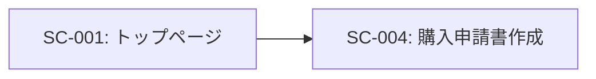
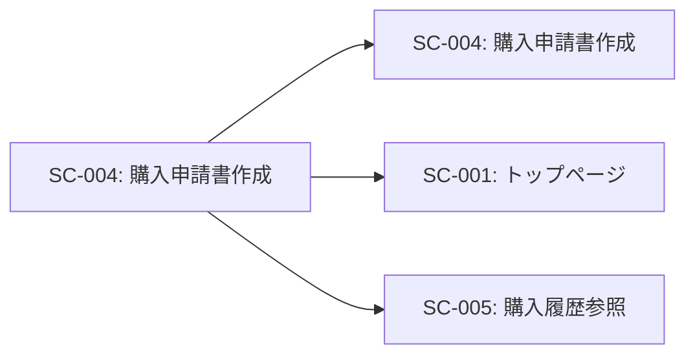

# SC-004: 購入申請書作成 画面仕様書

## 基本情報

| 項目 | 内容 |
|------|------|
| 画面ID | SC-004 |
| 画面名 | 購入申請書作成 |
| 画面種別 | 入力フォーム画面 |
| URL | /applicationForm |
| JSPファイル | applicationForm.jsp |
| Servletクラス | ApplicationFormServlet |
| 実装状況 | ⚠️ UI のみ実装（ビジネスロジック未実装） |
| 作成日 | 2025-11-03 |

---

## 画面概要

### 目的
物品の購入申請書を作成する。申請者情報、使用目的、購入する物品を入力し、上司や購買部門への申請を行う。

### 対象ユーザー
- 全社員（物品購入が必要な従業員）

### アクセス権限
- なし（現在は認証機能未実装）

### ビジネスルール
1. 申請番号は自動採番
2. 申請者は社員番号で指定
3. 使用目的は必須入力
4. 最低1つの物品を選択する必要がある
5. 合計金額が自動計算される
6. 選択された物品は削除可能

---

## 画面レイアウト

### レイアウト構成
```
┌─────────────────────────────────────────────┐
│           ヘッダー                            │
│   物品管理システム [ナビゲーション]            │
├─────────────────────────────────────────────┤
│                                              │
│        購入申請書作成                         │
│   ━━━━━━━━━━━━━━━━━━━━━━━━━━━━━━         │
│                                   [申請する] │
│                                              │
│   申請番号: 0343                              │
│                                              │
│   申請者（社員番号）                          │
│   ┌─────────────┐                           │
│   │例）0343      │                           │
│   └─────────────┘                           │
│                                              │
│   使用目的                                    │
│   ┌─────────────────────────────┐           │
│   │例）リフレッシュスペースの物品    │           │
│   │    購入のため。                  │           │
│   └─────────────────────────────┘           │
│                                              │
│   物品選択                      合計金額      │
│   ┌────────┐[追加する]        12,000円      │
│   │▼選択   │                                │
│   └────────┘                                │
│                                              │
│   物品一覧                                    │
│   ┌──────────────────────────────┐         │
│   │☑│No│品番・色│ASKUL│ページ│数量│         │
│   ├──────────────────────────────┤         │
│   │☑│1 │ベージュ│123..│0343  │2  │         │
│   │☑│2 │ベージュ│123..│0343  │2  │         │
│   └──────────────────────────────┘         │
│                                              │
│   [削除する]                                  │
│                                              │
└─────────────────────────────────────────────┘
```

### デザイン
- **フォームスタイル**: Bootstrap 3のフォームコンポーネント使用
- **ボタン**:
  - 申請する: 青色（btn-primary btn-lg）- 右上配置
  - 追加する: 水色（btn-info）
  - 削除する: 赤色（btn-danger）
- **テーブル**: .table .table-striped .table-hover .table-bordered
- **レスポンシブ対応**: Bootstrapグリッドシステム使用

---

## 画面要素

### ヘッダー部
| 要素 | 種類 | 説明 |
|------|------|------|
| システム名 | テキスト | 「物品管理システム」を表示 |
| ナビゲーションバー | メニュー | 共通ヘッダー（header.jsp） |
| 画面タイトル | h3 | 「購入申請書作成」とアイコン（glyphicon-book）表示 |

### 情報メッセージエリア
| 要素 | 種類 | 説明 |
|------|------|------|
| 情報メッセージ | alert-success | 成功時のメッセージ表示（infoMsg） |
| エラーメッセージ | alert-warning | エラー時のメッセージ表示（errorMsg） |

### 入力フォーム

#### 1. 申請番号（表示のみ）
- **ラベル**: 申請番号: 0343
- **種類**: 表示項目（入力不可）
- **説明**: 自動採番された申請番号を表示
- **隠しフィールド**: `<input type="hidden" name="catId" />`

#### 2. 申請者（社員番号）
| 項目 | 内容 |
|------|------|
| ラベル | 申請者（社員番号） |
| フィールド名 | catId |
| 入力タイプ | text |
| 最大文字数 | 4文字 |
| プレースホルダー | 例）0343 |
| 必須 | ○ |
| バリデーション | 4桁の数字 |

#### 3. 使用目的
| 項目 | 内容 |
|------|------|
| ラベル | 使用目的 |
| フィールド名 | textarea |
| 入力タイプ | textarea |
| 最大文字数 | 未指定 |
| プレースホルダー | 例）リフレッシュスペースの物品購入のため。 |
| 必須 | ○ |
| バリデーション | 1文字以上 |

#### 4. 物品選択
| 項目 | 内容 |
|------|------|
| ラベル | 物品選択 |
| フィールド名 | group |
| 入力タイプ | select（ドロップダウン） |
| データソース | groupList（requestスコープ） |
| 必須 | ○ |
| ボタン | 追加する（btn-info） |

#### 5. 合計金額（表示のみ）
- **ラベル**: 合計金額
- **表示**: 12,000円（右寄せ、h4サイズ）
- **説明**: 選択された物品の合計金額を表示
- **計算**: 数量 × 単価 の総和

---

## 物品一覧テーブル

### テーブル構成
| カラム名 | データ型 | 説明 | 幅 |
|---------|---------|------|-----|
| 選択 | checkbox | 削除対象の選択 | 固定 |
| No. | 数値 | 連番 | 固定 |
| 品番・色 | 文字列 | 物品の品番や色 | 自動 |
| ASKUL申込番号 | 文字列 | ASKULカタログの申込番号 | 自動 |
| カタログページ数 | 文字列 | カタログのページ番号 | 自動 |
| 数量 | 数値 | 購入数量 | 固定 |
| 単価（税抜） | 数値 | 1個あたりの単価 | 固定 |
| 合計（税抜） | 数値 | 数量×単価 | 固定 |

### サンプルデータ
```html
<tr>
  <td><input type="checkbox" class="checkbox" value="checkboxA"></td>
  <td>1</td>
  <td>ベージュ</td>
  <td>123456789</td>
  <td>0343</td>
  <td>2</td>
  <td>1200</td>
  <td>2400</td>
</tr>
```

---

## ボタン

### 1. 申請するボタン
| 項目 | 内容 |
|------|------|
| 表示テキスト | 申請する |
| ボタンタイプ | submit |
| スタイル | btn btn-primary btn-lg |
| 配置 | 右上 |
| 動作 | フォームをPOST送信 |
| 遷移先 | /applicationForm（POST） |

### 2. 追加するボタン
| 項目 | 内容 |
|------|------|
| 表示テキスト | 追加する |
| ボタンタイプ | submit |
| スタイル | btn btn-info |
| 配置 | 物品選択の右側 |
| 動作 | 選択された物品を一覧に追加 |

### 3. 削除するボタン
| 項目 | 内容 |
|------|------|
| 表示テキスト | 削除する |
| ボタンタイプ | submit |
| スタイル | btn btn-danger |
| 配置 | テーブルの下 |
| 動作 | チェックされた物品を一覧から削除 |

---

## 画面遷移

### 遷移元


| 遷移元画面ID | 遷移元画面名 | 遷移条件 |
|-------------|------------|---------|
| SC-001 | トップページ | 「購入申請書作成」ボタンをクリック |

### 遷移先


| 遷移先画面ID | 遷移先画面名 | 遷移条件 |
|-------------|------------|---------|
| SC-004 | 購入申請書作成 | 「追加する」または「削除する」ボタンクリック |
| SC-005 | 購入履歴参照 | 申請完了後（想定） |
| SC-001 | トップページ | ヘッダーの「TOP」をクリック |

---

## 処理フロー

### 画面初期表示（GET）
```
[開始]
   ↓
1. /applicationForm へGETリクエスト
   ↓
2. ApplicationFormServlet.doGet() 実行
   ↓
3. 申請番号を生成（自動採番）
   ↓
4. 物品選択リスト（groupList）を取得
   ↓
5. requestスコープに設定
   ↓
6. applicationForm.jsp へフォワード
   ↓
7. 画面表示
   - 申請番号表示
   - 空の入力フォーム
   - 物品選択ドロップダウン
   - 空の物品一覧テーブル
   ↓
[終了]
```

### 物品追加処理（POST - 追加する）
```
[開始]
   ↓
1. ユーザーが物品を選択
   ↓
2. 「追加する」ボタンをクリック
   ↓
3. /applicationForm へPOSTリクエスト
   ↓
4. ApplicationFormServlet.doPost() 実行
   ↓
5. 選択された物品情報を取得
   - group パラメータから物品特定
   ↓
6. セッションまたはリクエストスコープの一覧に追加
   ↓
7. 合計金額を再計算
   ↓
8. applicationForm.jsp へフォワード
   ↓
9. 画面再表示
   - 追加された物品がテーブルに表示
   - 合計金額が更新
   ↓
[終了]
```

### 物品削除処理（POST - 削除する）
```
[開始]
   ↓
1. ユーザーが削除する物品をチェック
   ↓
2. 「削除する」ボタンをクリック
   ↓
3. /applicationForm へPOSTリクエスト
   ↓
4. ApplicationFormServlet.doPost() 実行
   ↓
5. チェックボックスの値を取得
   ↓
6. 該当する物品を一覧から削除
   ↓
7. 合計金額を再計算
   ↓
8. applicationForm.jsp へフォワード
   ↓
9. 画面再表示
   - 削除された物品がテーブルから消える
   - 合計金額が更新
   ↓
[終了]
```

### 申請処理（POST - 申請する）
```
[開始]
   ↓
1. ユーザーが全項目を入力
   ↓
2. 「申請する」ボタンをクリック
   ↓
3. /applicationForm へPOSTリクエスト
   ↓
4. ApplicationFormServlet.doPost() 実行
   ↓
5. 入力値のバリデーション
   - 申請者（社員番号）が4桁の数字か
   - 使用目的が入力されているか
   - 物品が1つ以上選択されているか
   ↓
6. エラーがある場合
   - エラーメッセージを設定
   - 入力値を保持して画面再表示
   ↓
7. エラーがない場合
   - データベースに保存
     * 申請テーブル（application）に挿入
     * 申請明細テーブル（application_detail）に挿入
   - 成功メッセージを設定
   - 完了画面へ遷移 または 履歴画面へ遷移
   ↓
[終了]
```

---

## バリデーション

### 入力チェック

| 項目 | チェック内容 | エラーメッセージ |
|------|-------------|----------------|
| 申請者（社員番号） | 必須入力 | 申請者（社員番号）を入力してください。 |
| 申請者（社員番号） | 4桁の数字 | 申請者（社員番号）は4桁の数字で入力してください。 |
| 申請者（社員番号） | 存在チェック | 指定された社員番号が存在しません。 |
| 使用目的 | 必須入力 | 使用目的を入力してください。 |
| 使用目的 | 最大文字数 | 使用目的は500文字以内で入力してください。 |
| 物品選択 | 最低1件 | 物品を1つ以上選択してください。 |

### ビジネスロジックチェック

| 項目 | チェック内容 | エラーメッセージ |
|------|-------------|----------------|
| 申請番号 | 重複チェック | 申請番号が既に使用されています。 |
| 合計金額 | 上限チェック | 合計金額が上限（例: 100万円）を超えています。 |
| 物品在庫 | 在庫チェック | 選択された物品の在庫が不足しています。 |

---

## データベース操作

### 使用テーブル（想定）

#### 1. application（申請テーブル）
```sql
CREATE TABLE application (
    application_id INT PRIMARY KEY AUTO_INCREMENT,
    application_no VARCHAR(10) NOT NULL,
    employee_id VARCHAR(4) NOT NULL,
    purpose TEXT NOT NULL,
    total_amount DECIMAL(10, 2) NOT NULL,
    status VARCHAR(20) DEFAULT 'pending',
    created_at DATETIME DEFAULT CURRENT_TIMESTAMP,
    updated_at DATETIME DEFAULT CURRENT_TIMESTAMP ON UPDATE CURRENT_TIMESTAMP,
    FOREIGN KEY (employee_id) REFERENCES pers(pers_employee)
);
```

#### 2. application_detail（申請明細テーブル）
```sql
CREATE TABLE application_detail (
    detail_id INT PRIMARY KEY AUTO_INCREMENT,
    application_id INT NOT NULL,
    item_code INT NOT NULL,
    quantity INT NOT NULL,
    unit_price DECIMAL(10, 2) NOT NULL,
    total_price DECIMAL(10, 2) NOT NULL,
    FOREIGN KEY (application_id) REFERENCES application(application_id),
    FOREIGN KEY (item_code) REFERENCES item(item_code)
);
```

### INSERT操作

#### 申請登録
```sql
-- 申請ヘッダー登録
INSERT INTO application (
    application_no,
    employee_id,
    purpose,
    total_amount,
    status
) VALUES (?, ?, ?, ?, 'pending');

-- 申請明細登録（複数行）
INSERT INTO application_detail (
    application_id,
    item_code,
    quantity,
    unit_price,
    total_price
) VALUES (?, ?, ?, ?, ?);
```

---

## セキュリティ

### XSS対策
- **実装済み**: `<c:out>` タグによる自動エスケープ
- 入力値の表示時にエスケープ処理

### CSRF対策
- **未実装**: トークンによる正当性確認なし
- **改善提案**:
  ```jsp
  <input type="hidden" name="csrfToken" value="${csrfToken}">
  ```

### 入力値検証
- サーバーサイドでの厳格なバリデーション
- SQLインジェクション対策（PreparedStatement使用）

### 権限チェック
- **未実装**: 誰でも申請可能
- **改善提案**: ログイン中のユーザーのみ申請可能

---

## 現在の実装状況

### ✅ 実装済み
- JSP画面レイアウト
- フォーム要素の配置
- Bootstrap スタイル適用
- エラーメッセージ表示エリア

### ❌ 未実装
- ServletのdoGet()ロジック
- ServletのdoPost()ロジック
- バリデーション処理
- データベース保存処理
- 物品追加・削除機能
- 合計金額計算
- BLクラス（ApplicationFormBL）
- DAOクラス（ApplicationDAO）
- DTOクラス（Application, ApplicationDetail）
- Formクラス（ApplicationForm）

---

## 実装方針

### 推奨アーキテクチャ
```
[applicationForm.jsp]
   ↓ ↑
[ApplicationFormServlet]
   ↓ ↑
[ApplicationFormBL]
   ↓ ↑
[ApplicationDAO]
   ↓ ↑
[Database]
```

### クラス設計

#### ApplicationFormServlet
```java
@WebServlet("/applicationForm")
public class ApplicationFormServlet extends HttpServlet {
    protected void doGet(HttpServletRequest request, HttpServletResponse response)
            throws ServletException, IOException {
        // 初期表示処理
        // - 申請番号生成
        // - 物品リスト取得
        // - JSPへフォワード
    }

    protected void doPost(HttpServletRequest request, HttpServletResponse response)
            throws ServletException, IOException {
        // ボタン判定
        String action = request.getParameter("action");
        if ("add".equals(action)) {
            // 物品追加処理
        } else if ("delete".equals(action)) {
            // 物品削除処理
        } else if ("submit".equals(action)) {
            // 申請処理
        }
    }
}
```

#### ApplicationFormBL
```java
public class ApplicationFormBL {
    public String generateApplicationNo() {
        // 申請番号生成ロジック
    }

    public void registerApplication(Application application) {
        // 申請登録処理
    }

    public List<Item> getItemList() {
        // 物品リスト取得
    }
}
```

#### ApplicationDAO
```java
public class ApplicationDAO {
    public void insert(Connection conn, Application application) {
        // 申請ヘッダー登録
    }

    public void insertDetail(Connection conn, ApplicationDetail detail) {
        // 申請明細登録
    }
}
```

---

## テスト項目

### 機能テスト
- [ ] 画面が正常に表示されること
- [ ] 申請番号が自動表示されること
- [ ] 物品選択リストが表示されること
- [ ] 「追加する」ボタンで物品が追加されること
- [ ] 「削除する」ボタンで選択物品が削除されること
- [ ] 合計金額が正しく計算されること
- [ ] 「申請する」ボタンで申請が完了すること

### バリデーションテスト
- [ ] 申請者（社員番号）未入力でエラー
- [ ] 申請者（社員番号）が4桁以外でエラー
- [ ] 使用目的未入力でエラー
- [ ] 物品未選択でエラー

### データベーステスト
- [ ] 申請データが正しく登録されること
- [ ] 申請明細データが正しく登録されること
- [ ] トランザクションが正しく処理されること

### セキュリティテスト
- [ ] XSS攻撃に対する防御
- [ ] SQLインジェクションに対する防御
- [ ] CSRF攻撃に対する防御

---

## 改善提案

### 短期（1-3ヶ月）
1. **ビジネスロジックの実装**
   - Servlet、BL、DAOの実装
   - データベーステーブルの作成
   - CRUD機能の実装

2. **バリデーション強化**
   - クライアントサイドバリデーション（JavaScript）
   - サーバーサイドバリデーション

3. **ユーザビリティ向上**
   - 削除確認ダイアログ
   - 申請確認ダイアログ

### 中期（3-6ヶ月）
1. **検索・フィルタリング機能**
   - 物品のカテゴリ検索
   - キーワード検索

2. **ドラフト保存機能**
   - 途中保存
   - 下書き一覧

3. **承認フロー連携**
   - 上司への承認依頼
   - メール通知

### 長期（6ヶ月以降）
1. **ワークフロー機能**
   - 多段階承認
   - 差し戻し機能

2. **ファイル添付**
   - 見積書の添付
   - 画像の添付

3. **モバイル対応強化**
   - スマートフォン最適化
   - タブレット対応

---

## 関連ドキュメント

- [画面一覧](../screen_list.md)
- [SC-001: トップページ](SC-001_index.md)
- [SC-005: 購入履歴参照](SC-005_history_view.md)
- [SC-006: 物品マスタ](SC-006_item_master.md)
- [機能一覧](../function_list.md): F-001（購入申請機能）
- [業務一覧](../business_process_list.md): BP-001（物品購入プロセス）
- [テーブル一覧](../table_list.md)

---

## 変更履歴

| 日付 | バージョン | 変更内容 | 担当者 |
|------|-----------|---------|--------|
| 2025-11-03 | 1.0 | 初版作成 | - |

---

## 承認

| 役割 | 氏名 | 承認日 |
|------|------|--------|
| 作成者 | | 2025-11-03 |
| レビュー担当 | | |
| 承認者 | | |
