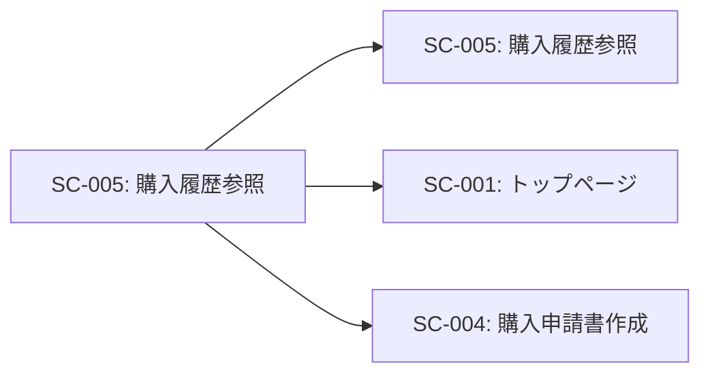

# SC-005: 購入履歴参照 画面仕様書

## 基本情報

| 項目 | 内容 |
|------|------|
| 画面ID | SC-005 |
| 画面名 | 購入履歴参照 |
| 画面種別 | 検索・一覧表示画面 |
| URL | /historyView |
| JSPファイル | historyView.jsp |
| Servletクラス | HistoryViewServlet |
| 実装状況 | ⚠️ UI のみ実装（ビジネスロジック未実装） |
| 作成日 | 2025-11-03 |

---

## 画面概要

### 目的
過去に申請・承認された購入履歴を参照する。申請番号、日付範囲での検索機能を提供し、購入物品の詳細を確認できる。

### 対象ユーザー
- 全社員（自分の申請履歴を確認）
- 購買担当者（全社の購入履歴を確認）
- 経理担当者（支出確認）
- 上司・管理者（承認済み申請の確認）

### アクセス権限
- なし（現在は認証機能未実装）

---

## 画面レイアウト

### レイアウト構成
```
┌─────────────────────────────────────────────┐
│           ヘッダー                            │
│   物品管理システム [ナビゲーション]            │
├─────────────────────────────────────────────┤
│                                              │
│        物品履歴参照                           │
│   ━━━━━━━━━━━━━━━━━━━━━━━━━━━━━━         │
│                                              │
│   申請番号                                    │
│   ┌─────────────┐                           │
│   │例）0343      │                           │
│   └─────────────┘                           │
│                                              │
│   日付(From)       日付(To)                  │
│   ┌──────────┐  ┌──────────┐              │
│   │クリックして │  │クリックして │              │
│   │ください    │  │ください    │              │
│   └──────────┘  └──────────┘              │
│                                              │
│   ☐ 削除含む                                 │
│                                              │
│   [検索する]                                  │
│                                              │
│   ─────────────────────────                 │
│                              合計金額         │
│                              12,000円        │
│   物品一覧                                    │
│   ┌──────────────────────────────┐         │
│   │No│品番・色│ASKUL│ページ│数量│単価│      │
│   ├──────────────────────────────┤         │
│   │1 │ベージュ│123..│0343  │2  │1200│      │
│   │2 │ベージュ│123..│0343  │2  │1200│      │
│   └──────────────────────────────┘         │
│                                              │
└─────────────────────────────────────────────┘
```

### デザイン
- **フォームスタイル**: Bootstrap 3のフォームコンポーネント使用
- **ボタン**: 青色（btn-primary）
- **テーブル**: .table .table-striped .table-hover .table-bordered
- **日付ピッカー**: flatpickr.js使用
- **レスポンシブ対応**: Bootstrapグリッドシステム使用

---

## 画面要素

### ヘッダー部
| 要素 | 種類 | 説明 |
|------|------|------|
| システム名 | テキスト | 「物品管理システム」を表示 |
| ナビゲーションバー | メニュー | 共通ヘッダー（header.jsp） |
| 画面タイトル | h3 | 「物品履歴参照」とアイコン（glyphicon-book）表示 |

### 検索条件フォーム

#### 1. 申請番号
| 項目 | 内容 |
|------|------|
| ラベル | 申請番号 |
| フィールド名 | catId |
| 入力タイプ | text |
| 最大文字数 | 4文字 |
| プレースホルダー | 例）0343 |
| 必須 | × |
| バリデーション | 数字のみ |

#### 2. 日付(From)
| 項目 | 内容 |
|------|------|
| ラベル | 日付(Form) |
| フィールド名 | calendar（dateFrom） |
| 入力タイプ | text（日付ピッカー） |
| プレースホルダー | クリックしてください |
| 必須 | × |
| 形式 | YYYY-MM-DD |
| ライブラリ | flatpickr.js |

#### 3. 日付(To)
| 項目 | 内容 |
|------|------|
| ラベル | 日付(To) |
| フィールド名 | calendar（dateTo） |
| 入力タイプ | text（日付ピッカー） |
| プレースホルダー | クリックしてください |
| 必須 | × |
| 形式 | YYYY-MM-DD |
| ライブラリ | flatpickr.js |

#### 4. 削除含むチェックボックス
| 項目 | 内容 |
|------|------|
| ラベル | 削除含む |
| フィールド名 | includeDeleted |
| 入力タイプ | checkbox |
| デフォルト値 | チェックなし |
| 説明 | チェックすると削除済み申請も表示 |

#### 5. 検索するボタン
| 項目 | 内容 |
|------|------|
| 表示テキスト | 検索する |
| ボタンタイプ | button |
| スタイル | btn btn-primary |
| 動作 | 検索条件に基づいてデータ取得 |

---

## 検索結果表示

### 合計金額（表示のみ）
- **ラベル**: 合計金額
- **表示**: 12,000円（右寄せ、h4サイズ）
- **説明**: 検索結果の物品合計金額を表示
- **計算**: 検索結果の全物品の（数量 × 単価）の総和

### 物品一覧テーブル

#### テーブル構成
| カラム名 | データ型 | 説明 | 幅 |
|---------|---------|------|-----|
| No. | 数値 | 連番 | 固定 |
| 品番・色 | 文字列 | 物品の品番や色 | 自動 |
| ASKUL申込番号 | 文字列 | ASKULカタログの申込番号 | 自動 |
| カタログページ数 | 文字列 | カタログのページ番号 | 自動 |
| 数量 | 数値 | 購入数量 | 固定 |
| 単価（税抜） | 数値 | 1個あたりの単価 | 固定 |
| 合計（税抜） | 数値 | 数量×単価 | 固定 |

#### サンプルデータ
```html
<tr>
  <td>1</td>
  <td>ベージュ</td>
  <td>123456789</td>
  <td>0343</td>
  <td>2</td>
  <td>1200</td>
  <td>2400</td>
</tr>
```

---

## 画面遷移

### 遷移元


| 遷移元画面ID | 遷移元画面名 | 遷移条件 |
|-------------|------------|---------|
| SC-001 | トップページ | 「購入履歴参照」ボタンをクリック |

### 遷移先


| 遷移先画面ID | 遷移先画面名 | 遷移条件 |
|-------------|------------|---------|
| SC-005 | 購入履歴参照 | 「検索する」ボタンクリック |
| SC-001 | トップページ | ヘッダーの「TOP」をクリック |
| SC-004 | 購入申請書作成 | ヘッダーの「購入申請書作成」をクリック |

---

## 処理フロー

### 画面初期表示（GET）
```
[開始]
   ↓
1. /historyView へGETリクエスト
   ↓
2. HistoryViewServlet.doGet() 実行
   ↓
3. デフォルト検索条件の設定
   - 日付From: 当月1日
   - 日付To: 本日
   - 削除含む: OFF
   ↓
4. historyView.jsp へフォワード
   ↓
5. 画面表示
   - 空の検索フォーム
   - 空の物品一覧テーブル
   ↓
[終了]
```

### 検索処理（POST）
```
[開始]
   ↓
1. ユーザーが検索条件を入力
   - 申請番号（任意）
   - 日付From（任意）
   - 日付To（任意）
   - 削除含む（任意）
   ↓
2. 「検索する」ボタンをクリック
   ↓
3. /historyView へPOSTリクエスト
   ↓
4. HistoryViewServlet.doPost() 実行
   ↓
5. パラメータ取得
   - catId（申請番号）
   - dateFrom（開始日）
   - dateTo（終了日）
   - includeDeleted（削除含む）
   ↓
6. 入力値のバリデーション
   - 日付の妥当性チェック
   - FromとToの大小関係チェック
   ↓
7. HistoryViewBL.searchHistory() 呼び出し
   ↓
8. HistoryDAO.search() 実行
   ↓
9. データベースから履歴データを取得
   SELECT
       a.application_no,
       ad.item_code,
       i.item_name,
       ad.quantity,
       ad.unit_price,
       ad.total_price
   FROM application a
   INNER JOIN application_detail ad
       ON a.application_id = ad.application_id
   INNER JOIN item i
       ON ad.item_code = i.item_code
   WHERE 1=1
       AND (a.application_no = ? OR ? IS NULL)
       AND (a.created_at >= ? OR ? IS NULL)
       AND (a.created_at <= ? OR ? IS NULL)
       AND (a.deleted_flg = 0 OR ? = 1)
   ORDER BY a.created_at DESC
   ↓
10. ResultSetをList<ApplicationHistory>に変換
   ↓
11. 合計金額を計算
   ↓
12. リストとトータルをrequestスコープに設定
    request.setAttribute("historyList", historyList)
    request.setAttribute("totalAmount", totalAmount)
   ↓
13. 検索条件を保持
    request.setAttribute("catId", catId)
    request.setAttribute("dateFrom", dateFrom)
    request.setAttribute("dateTo", dateTo)
    request.setAttribute("includeDeleted", includeDeleted)
   ↓
14. historyView.jsp へフォワード
   ↓
15. 画面表示
    - 検索条件が保持される
    - 検索結果がテーブルに表示される
    - 合計金額が表示される
   ↓
[終了]
```

---

## バリデーション

### 入力チェック

| 項目 | チェック内容 | エラーメッセージ |
|------|-------------|----------------|
| 申請番号 | 数字のみ | 申請番号は数字で入力してください。 |
| 日付(From) | 日付形式 | 日付(From)の形式が不正です。YYYY-MM-DD形式で入力してください。 |
| 日付(To) | 日付形式 | 日付(To)の形式が不正です。YYYY-MM-DD形式で入力してください。 |
| 日付範囲 | From <= To | 日付(From)は日付(To)以前の日付を指定してください。 |
| 日付範囲 | 過去の日付 | 未来の日付は指定できません。 |
| 日付範囲 | 最大期間 | 検索期間は最大1年間です。 |

### ビジネスロジックチェック

| 項目 | チェック内容 | エラーメッセージ |
|------|-------------|----------------|
| 検索結果 | 0件の場合 | 検索条件に一致するデータが見つかりませんでした。 |
| 検索結果 | 上限超過 | 検索結果が1000件を超えました。検索条件を絞り込んでください。 |

---

## JavaScript

### flatpickr（日付ピッカー）

#### 初期化コード
```javascript
// flatpickrの初期化
flatpickr('#calendar');
```

#### 推奨設定（改善版）
```javascript
// 日付(From)の初期化
flatpickr('#dateFrom', {
    dateFormat: 'Y-m-d',
    locale: 'ja',
    maxDate: 'today',
    onChange: function(selectedDates, dateStr, instance) {
        // 日付(To)の最小日付を更新
        flatpickrTo.set('minDate', dateStr);
    }
});

// 日付(To)の初期化
const flatpickrTo = flatpickr('#dateTo', {
    dateFormat: 'Y-m-d',
    locale: 'ja',
    maxDate: 'today'
});
```

### 検索結果の動的更新（将来実装）
```javascript
// Ajax検索
function searchHistory() {
    $.ajax({
        url: '/historyView',
        type: 'POST',
        data: {
            catId: $('#catId').val(),
            dateFrom: $('#dateFrom').val(),
            dateTo: $('#dateTo').val(),
            includeDeleted: $('#includeDeleted').is(':checked')
        },
        success: function(response) {
            // テーブルを更新
            updateTable(response.historyList);
            updateTotalAmount(response.totalAmount);
        },
        error: function(xhr, status, error) {
            alert('検索に失敗しました。');
        }
    });
}
```

---

## データベース操作

### 使用テーブル（想定）

#### 1. application（申請テーブル）
```sql
CREATE TABLE application (
    application_id INT PRIMARY KEY AUTO_INCREMENT,
    application_no VARCHAR(10) NOT NULL,
    employee_id VARCHAR(4) NOT NULL,
    purpose TEXT NOT NULL,
    total_amount DECIMAL(10, 2) NOT NULL,
    status VARCHAR(20) DEFAULT 'pending',
    deleted_flg TINYINT DEFAULT 0,
    created_at DATETIME DEFAULT CURRENT_TIMESTAMP,
    updated_at DATETIME DEFAULT CURRENT_TIMESTAMP ON UPDATE CURRENT_TIMESTAMP,
    FOREIGN KEY (employee_id) REFERENCES pers(pers_employee)
);
```

#### 2. application_detail（申請明細テーブル）
```sql
CREATE TABLE application_detail (
    detail_id INT PRIMARY KEY AUTO_INCREMENT,
    application_id INT NOT NULL,
    item_code INT NOT NULL,
    quantity INT NOT NULL,
    unit_price DECIMAL(10, 2) NOT NULL,
    total_price DECIMAL(10, 2) NOT NULL,
    FOREIGN KEY (application_id) REFERENCES application(application_id),
    FOREIGN KEY (item_code) REFERENCES item(item_code)
);
```

#### 3. item（物品マスタ）
```sql
-- 既存テーブル
CREATE TABLE item (
    item_code INT(3) PRIMARY KEY,
    item_hin VARCHAR(100),
    item_name VARCHAR(40),
    -- ...
);
```

### SELECT操作

#### 購入履歴検索
```sql
-- 複数条件での検索
SELECT
    a.application_id,
    a.application_no,
    a.employee_id,
    a.purpose,
    a.total_amount,
    a.status,
    a.created_at,
    ad.detail_id,
    ad.item_code,
    i.item_hin,
    i.item_name,
    ad.quantity,
    ad.unit_price,
    ad.total_price
FROM application a
INNER JOIN application_detail ad
    ON a.application_id = ad.application_id
INNER JOIN item i
    ON ad.item_code = i.item_code
WHERE 1=1
    AND (a.application_no = ? OR ? IS NULL)
    AND (DATE(a.created_at) >= ? OR ? IS NULL)
    AND (DATE(a.created_at) <= ? OR ? IS NULL)
    AND (a.deleted_flg = 0 OR ? = 1)
ORDER BY a.created_at DESC, ad.detail_id ASC
LIMIT 1000;
```

### インデックス設計
```sql
-- パフォーマンス向上のためのインデックス
CREATE INDEX idx_application_no ON application(application_no);
CREATE INDEX idx_application_created_at ON application(created_at);
CREATE INDEX idx_application_deleted_flg ON application(deleted_flg);
CREATE INDEX idx_application_detail_application_id ON application_detail(application_id);
```

---

## 使用技術

### フロントエンド
- **HTML5**
- **CSS3**
- **Bootstrap 3.x**
  - グリッドシステム
  - フォームコンポーネント
  - テーブルコンポーネント
  - Glyphicon
- **jQuery 1.12.4**
- **flatpickr.js** - 日付ピッカーライブラリ
  - flatpickr.min.css
  - flatpickr.js

### バックエンド
- **Java Servlet API**
- **JSP (JavaServer Pages)**
- **JSTL (JSP Standard Tag Library)**
- **JDBC (Java Database Connectivity)**
- **MySQL**

---

## セキュリティ

### XSS対策
- **実装済み**: `<c:out>` タグによる自動エスケープ
- 検索条件の入力値もエスケープして再表示

### SQL Injection対策
- **実装必要**: PreparedStatementの使用
- パラメータバインディングで安全なSQL実行

### 権限チェック
- **未実装**: 誰でも全履歴を参照可能
- **改善提案**:
  - 一般社員: 自分の申請履歴のみ参照可能
  - 購買担当者: 全社の購入履歴を参照可能
  - 上司: 自部門の購入履歴を参照可能

### データマスキング
- **未実装**: 個人情報の保護
- **改善提案**: 権限に応じて表示項目を制限

---

## パフォーマンス

### 現状の懸念
1. **全件取得の可能性**
   - 検索条件なしで大量データ取得
   - メモリ使用量の増加

2. **JOIN処理の負荷**
   - 3テーブルのJOIN
   - 大量データでの処理時間増加

3. **ページネーションなし**
   - 検索結果を一括表示

### 最適化提案

#### 短期（1-2ヶ月）
1. **LIMIT句の追加**
   ```sql
   LIMIT 1000;  -- 最大1000件まで取得
   ```

2. **インデックスの追加**
   - 検索条件のカラムにインデックス作成
   - JOIN対象カラムにインデックス作成

3. **検索条件の必須化**
   - 日付範囲を必須にする
   - デフォルトで当月を設定

#### 中期（3-6ヶ月）
1. **ページネーション実装**
   - 20件/50件/100件ずつ表示
   - ページ番号での移動

2. **検索結果のキャッシュ**
   - 同じ検索条件での再検索を高速化

3. **非同期検索**
   - Ajax + JSON APIでデータ取得
   - ローディングインジケータ表示

#### 長期（6ヶ月以降）
1. **集計テーブルの作成**
   - 月次集計データを事前作成
   - サマリー情報の高速表示

2. **Elasticsearchの導入**
   - 高速な全文検索
   - 複雑な検索条件への対応

---

## 現在の実装状況

### ✅ 実装済み
- JSP画面レイアウト
- 検索フォーム要素の配置
- Bootstrap スタイル適用
- flatpickr（日付ピッカー）の基本実装

### ❌ 未実装
- ServletのdoGet()ロジック
- ServletのdoPost()ロジック
- バリデーション処理
- データベース検索処理
- BLクラス（HistoryViewBL）
- DAOクラス（HistoryDAO）
- DTOクラス（ApplicationHistory）
- データベーステーブル（application, application_detail）

---

## テスト項目

### 機能テスト
- [ ] 画面が正常に表示されること
- [ ] 日付ピッカーが正常に動作すること
- [ ] 検索ボタンで検索が実行されること
- [ ] 検索条件が正しく反映されること
- [ ] 検索結果がテーブルに表示されること
- [ ] 合計金額が正しく計算されること

### 検索条件テスト
- [ ] 申請番号のみで検索できること
- [ ] 日付範囲のみで検索できること
- [ ] 複数条件の組み合わせで検索できること
- [ ] 削除含むチェックで削除済みデータが表示されること
- [ ] 検索条件なしでデフォルト検索が実行されること

### バリデーションテスト
- [ ] 不正な日付形式でエラー
- [ ] From > To の関係でエラー
- [ ] 未来の日付でエラー
- [ ] 1年以上の範囲指定でエラー

### パフォーマンステスト
- [ ] 100件: 1秒以内で表示
- [ ] 500件: 3秒以内で表示
- [ ] 1000件: 5秒以内で表示

### セキュリティテスト
- [ ] XSS攻撃に対する防御
- [ ] SQLインジェクションに対する防御
- [ ] 権限チェック（自分の履歴のみ表示）

---

## 改善提案

### 短期（1-3ヶ月）
1. **ビジネスロジックの実装**
   - Servlet、BL、DAOの実装
   - データベーステーブルの作成
   - 検索機能の実装

2. **バリデーション強化**
   - クライアントサイドバリデーション
   - サーバーサイドバリデーション

3. **詳細表示機能**
   - 各行をクリックで申請詳細を表示
   - モーダルまたは別画面で表示

### 中期（3-6ヶ月）
1. **高度な検索機能**
   - 社員番号検索
   - 部署検索
   - 金額範囲検索
   - ステータス検索（pending, approved, rejected）

2. **エクスポート機能**
   - CSV出力
   - Excel出力
   - PDF出力

3. **ページネーション**
   - 表示件数選択
   - ページ移動

### 長期（6ヶ月以降）
1. **統計・分析機能**
   - 月別集計グラフ
   - 部署別集計
   - 品目別集計

2. **ダッシュボード化**
   - サマリー情報の表示
   - トレンド分析

3. **モバイル最適化**
   - レスポンシブデザイン強化
   - タッチ操作対応

---

## 関連ドキュメント

- [画面一覧](../screen_list.md)
- [SC-001: トップページ](SC-001_index.md)
- [SC-004: 購入申請書作成](SC-004_application_form.md)
- [機能一覧](../function_list.md): F-002（購入履歴参照機能）
- [業務一覧](../business_process_list.md): BP-001（物品購入プロセス）
- [テーブル一覧](../table_list.md)

---

## 変更履歴

| 日付 | バージョン | 変更内容 | 担当者 |
|------|-----------|---------|--------|
| 2025-11-03 | 1.0 | 初版作成 | - |

---

## 承認

| 役割 | 氏名 | 承認日 |
|------|------|--------|
| 作成者 | | 2025-11-03 |
| レビュー担当 | | |
| 承認者 | | |
