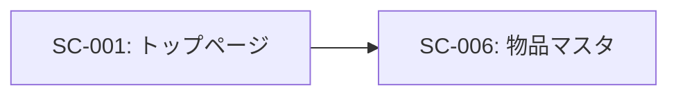
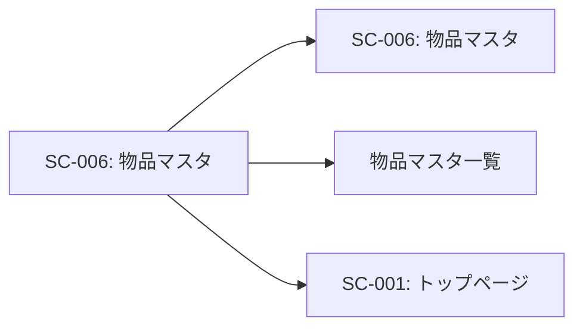

# SC-006: 物品マスタ 画面仕様書

## 基本情報

| 項目 | 内容 |
|------|------|
| 画面ID | SC-006 |
| 画面名 | 物品マスタ |
| 画面種別 | CRUD操作画面（作成・参照・更新・削除） |
| URL | /item |
| JSPファイル | itemMst.jsp |
| Servletクラス | ItemMstServlet |
| 実装状況 | ⚠️ UI のみ実装（ビジネスロジック未実装） |
| 作成日 | 2025-11-03 |

---

## 画面概要

### 目的
購入可能な物品の情報を管理する。物品の登録、参照、更新、削除のCRUD操作を行う。

### 対象ユーザー
- 購買担当者
- システム管理者

### アクセス権限
- なし（現在は認証機能未実装）

### ビジネスルール
1. 物品コードは自動採番または手動入力
2. 品名は必須入力
3. ASKUL申込番号は一意である必要がある
4. 単価は0以上の数値
5. 使用中の物品は削除できない（論理削除推奨）

---

## 画面レイアウト

### レイアウト構成
```
┌─────────────────────────────────────────────┐
│           ヘッダー                            │
│   物品管理システム [ナビゲーション]            │
├─────────────────────────────────────────────┤
│                                              │
│        物品マスタ                             │
│   ━━━━━━━━━━━━━━━━━━━━━━━━━━━━━━         │
│                                              │
│   [一覧表示]                                  │
│                                              │
│   物品 - 選択                                 │
│   ┌────────────────┐                        │
│   │▼選択          │                         │
│   └────────────────┘                        │
│                                              │
│   品名                                        │
│   ┌─────────────┐                           │
│   │例）コーヒー   │                           │
│   └─────────────┘                           │
│                                              │
│   品番・色                                    │
│   ┌─────────────┐                           │
│   │例）ネイビー   │                           │
│   └─────────────┘                           │
│                                              │
│   ASKUL申込番号    カタログページ数           │
│   ┌──────────┐  ┌──────────┐              │
│   │123456789  │  │343        │              │
│   └──────────┘  └──────────┘              │
│                                              │
│   単価                                        │
│   ┌─────────────┐                           │
│   │例）1200      │                           │
│   └─────────────┘                           │
│                                              │
│   [登録する] または [更新する] [削除する]      │
│                                              │
└─────────────────────────────────────────────┘
```

### デザイン
- **フォームスタイル**: Bootstrap 3のフォームコンポーネント使用
- **ボタン**:
  - 一覧表示: 水色（btn-info）
  - 登録する: 青色（btn-primary）
  - 更新する: 青色（btn-primary）
  - 削除する: 赤色（btn-danger）
- **レスポンシブ対応**: Bootstrapグリッドシステム使用

---

## 画面要素

### ヘッダー部
| 要素 | 種類 | 説明 |
|------|------|------|
| システム名 | テキスト | 「物品管理システム」を表示 |
| ナビゲーションバー | メニュー | 共通ヘッダー（header.jsp） |
| 画面タイトル | h3 | 「物品マスタ」とアイコン（glyphicon-th-list）表示 |

### メッセージエリア
| 要素 | 種類 | 説明 |
|------|------|------|
| 情報メッセージ | alert-info | 成功時のメッセージ表示（infoMsg） |
| エラーメッセージ | alert-warning | エラー時のメッセージ表示（errorMsg） |

### 入力フォーム

#### 1. 一覧表示ボタン
| 項目 | 内容 |
|------|------|
| 表示テキスト | 一覧表示 |
| ボタンタイプ | submit |
| name | execute |
| value | list |
| スタイル | btn btn-info |
| 動作 | 物品一覧画面への遷移 |

#### 2. 物品選択ドロップダウン
| 項目 | 内容 |
|------|------|
| ラベル | 物品 - 選択 |
| フィールド名 | itemName |
| 入力タイプ | select（ドロップダウン） |
| データソース | itemInfo（requestスコープ） |
| 動作 | onChange時にgetList()実行 |
| 説明 | 選択すると該当物品の詳細を表示 |

#### 3. 品名
| 項目 | 内容 |
|------|------|
| ラベル | 品名 |
| フィールド名 | catId |
| 入力タイプ | text |
| 最大文字数 | 4文字 |
| プレースホルダー | 例）コーヒー |
| 必須 | ○ |
| バリデーション | 1文字以上、100文字以内 |

#### 4. 品番・色
| 項目 | 内容 |
|------|------|
| ラベル | 品番・色 |
| フィールド名 | itemName |
| 入力タイプ | text |
| 最大文字数 | 7文字 |
| プレースホルダー | 例）ネイビー |
| 必須 | × |
| バリデーション | 40文字以内 |

#### 5. ASKUL申込番号
| 項目 | 内容 |
|------|------|
| ラベル | ASKUL申込番号 |
| フィールド名 | catId |
| 入力タイプ | text |
| 最大文字数 | 40文字 |
| プレースホルダー | 例）123456789 |
| 必須 | ○ |
| バリデーション | 数字のみ、9桁 |

#### 6. カタログページ数
| 項目 | 内容 |
|------|------|
| ラベル | カタログページ数 |
| フィールド名 | itemName |
| 入力タイプ | text |
| 最大文字数 | 40文字 |
| プレースホルダー | 例）343 |
| 必須 | × |
| バリデーション | 数字のみ |

#### 7. 単価
| 項目 | 内容 |
|------|------|
| ラベル | 単価 |
| フィールド名 | itemName |
| 入力タイプ | text |
| 最大文字数 | 40文字 |
| プレースホルダー | 例）1200 |
| 必須 | ○ |
| バリデーション | 0以上の数値 |

---

## ボタン

### 1. 登録するボタン（新規登録モード）
| 項目 | 内容 |
|------|------|
| 表示テキスト | 登録する |
| ボタンタイプ | submit |
| name | execute |
| value | register |
| スタイル | btn btn-primary |
| 表示条件 | editFlg が空またはfalse |
| 動作 | 新規物品をデータベースに登録 |

### 2. 更新するボタン（編集モード）
| 項目 | 内容 |
|------|------|
| 表示テキスト | 更新する |
| ボタンタイプ | submit |
| name | execute |
| value | update |
| スタイル | btn btn-primary |
| 表示条件 | editFlg が true |
| 動作 | 選択された物品情報を更新 |
| onClick | unDisabled() |

### 3. 削除するボタン（編集モード）
| 項目 | 内容 |
|------|------|
| 表示テキスト | 削除する |
| ボタンタイプ | submit |
| name | execute |
| value | delete |
| スタイル | btn btn-danger |
| 表示条件 | editFlg が true |
| 動作 | 選択された物品を削除 |
| onClick | unDisabled() |

---

## 画面遷移

### 遷移元


| 遷移元画面ID | 遷移元画面名 | 遷移条件 |
|-------------|------------|---------|
| SC-001 | トップページ | 「物品マスタ」ボタンをクリック |

### 遷移先


| 遷移先画面ID | 遷移先画面名 | 遷移条件 |
|-------------|------------|---------|
| SC-006 | 物品マスタ | 登録・更新・削除後に同じ画面へ |
| 物品マスタ一覧 | 物品マスタ一覧 | 「一覧表示」ボタンをクリック（未実装） |
| SC-001 | トップページ | ヘッダーの「TOP」をクリック |

---

## 処理フロー

### 画面初期表示（GET）
```
[開始]
   ↓
1. /item へGETリクエスト
   ↓
2. ItemMstServlet.doGet() 実行
   ↓
3. 物品選択リスト（itemInfo）を取得
   - ItemMstBL.getItemList() 呼び出し
   - ItemDAO.selectAll() でデータベースから全物品取得
   ↓
4. requestスコープに設定
   request.setAttribute("itemInfo", itemInfo)
   ↓
5. itemMst.jsp へフォワード
   ↓
6. 画面表示
   - 物品選択ドロップダウンに一覧表示
   - 空の入力フォーム
   - 「登録する」ボタン表示
   ↓
[終了]
```

### 物品選択処理（POST - select）
```
[開始]
   ↓
1. ユーザーが物品選択ドロップダウンを変更
   ↓
2. onChange イベントで getList() 実行
   ↓
3. 隠しフィールド execute="select" を追加
   ↓
4. フォームをPOST送信
   ↓
5. /item へPOSTリクエスト（execute=select）
   ↓
6. ItemMstServlet.doPost() 実行
   ↓
7. 選択された物品名を取得
   String itemName = request.getParameter("itemName")
   ↓
8. ItemMstBL.getItem(itemName) 呼び出し
   ↓
9. ItemDAO.selectByName(conn, itemName) 実行
   SELECT * FROM refresh.item WHERE item_name = ?
   ↓
10. Itemオブジェクトを取得
   ↓
11. requestスコープに設定
    request.setAttribute("item", item)
    request.setAttribute("editFlg", true)
    request.setAttribute("itemInfo", itemInfo)
   ↓
12. itemMst.jsp へフォワード
   ↓
13. 画面再表示
    - 選択された物品の詳細が入力フォームに表示
    - 「更新する」「削除する」ボタン表示
   ↓
[終了]
```

### 新規登録処理（POST - register）
```
[開始]
   ↓
1. ユーザーが物品情報を入力
   ↓
2. 「登録する」ボタンをクリック
   ↓
3. /item へPOSTリクエスト（execute=register）
   ↓
4. ItemMstServlet.doPost() 実行
   ↓
5. パラメータ取得
   - 品名
   - 品番・色
   - ASKUL申込番号
   - カタログページ数
   - 単価
   ↓
6. ItemFormオブジェクト生成
   ↓
7. バリデーション実行
   - 必須チェック
   - 形式チェック
   - 重複チェック
   ↓
8. エラーがある場合
   - エラーメッセージを設定
   - 入力値を保持して画面再表示
   ↓
9. エラーがない場合
   - ItemMstBL.registerItem(itemForm) 呼び出し
   - ItemDAO.insert(conn, item) 実行
     INSERT INTO refresh.item (...) VALUES (...)
   - コミット
   ↓
10. 成功メッセージを設定
    infoMsg.add("物品を登録しました。")
   ↓
11. 画面再表示（初期状態）
   ↓
[終了]
```

### 更新処理（POST - update）
```
[開始]
   ↓
1. ユーザーが物品情報を修正
   ↓
2. 「更新する」ボタンをクリック
   ↓
3. onClick="unDisabled()" 実行
   - employeeId（物品コード）のdisabledを解除
   ↓
4. /item へPOSTリクエスト（execute=update）
   ↓
5. ItemMstServlet.doPost() 実行
   ↓
6. パラメータ取得
   ↓
7. バリデーション実行
   ↓
8. エラーがない場合
   - ItemMstBL.updateItem(itemForm) 呼び出し
   - ItemDAO.update(conn, item) 実行
     UPDATE refresh.item SET ... WHERE item_code = ?
   - コミット
   ↓
9. 成功メッセージを設定
    infoMsg.add("物品情報を更新しました。")
   ↓
10. 画面再表示（更新後の状態）
   ↓
[終了]
```

### 削除処理（POST - delete）
```
[開始]
   ↓
1. ユーザーが削除対象の物品を選択
   ↓
2. 「削除する」ボタンをクリック
   ↓
3. onClick="unDisabled()" 実行
   ↓
4. 確認ダイアログ表示（推奨）
   「本当に削除しますか?」
   ↓
5. /item へPOSTリクエスト（execute=delete）
   ↓
6. ItemMstServlet.doPost() 実行
   ↓
7. 物品コードを取得
   ↓
8. 使用チェック（推奨）
   - 申請中・承認済みの物品は削除不可
   ↓
9. ItemMstBL.deleteItem(itemCode) 呼び出し
   ↓
10. ItemDAO.delete(conn, itemCode) 実行
    ※物理削除
    DELETE FROM refresh.item WHERE item_code = ?
    または
    ※論理削除（推奨）
    UPDATE refresh.item SET deleted_flg = 1 WHERE item_code = ?
   ↓
11. コミット
   ↓
12. 成功メッセージを設定
    infoMsg.add("物品を削除しました。")
   ↓
13. 画面再表示（初期状態）
   ↓
[終了]
```

### 一覧表示処理（POST - list）
```
[開始]
   ↓
1. 「一覧表示」ボタンをクリック
   ↓
2. /item へPOSTリクエスト（execute=list）
   ↓
3. ItemMstServlet.doPost() 実行
   ↓
4. ItemMstBL.getItemList() 呼び出し
   ↓
5. ItemDAO.selectAll(conn) 実行
   SELECT * FROM refresh.item ORDER BY item_code
   ↓
6. List<Item>を取得
   ↓
7. requestスコープに設定
    request.setAttribute("itemList", itemList)
   ↓
8. itemMstList.jsp へフォワード（想定）
   ↓
9. 一覧画面表示
   ↓
[終了]
```

---

## JavaScript

### 関数一覧

#### getList()
```javascript
function getList() {
    var form = this.document.forms.form1;
    var input = this.document.createElement('input');
    input.setAttribute('name', 'execute');
    input.setAttribute('value', 'select');
    form.appendChild(input);
    form.submit();
}
```

**説明**: ドロップダウン選択時に特定物品情報を取得

**トリガー**: 物品選択ドロップダウンのonChangeイベント

**処理内容**:
1. form1を取得
2. 隠しinput要素を作成（name="execute", value="select"）
3. フォームに追加
4. フォームをPOST送信

#### unDisabled()
```javascript
function unDisabled() {
    document.getElementById("employeeId").disabled = false;
    return true;
}
```

**説明**: disabled状態のテキストボックスを一時的に解除

**トリガー**: 「更新する」「削除する」ボタンのonClickイベント

**処理内容**:
1. employeeId（物品コード）フィールドのdisabledを解除
2. POST送信時に物品コードを含める

**注意**: 実際のJSPではemployeeIdではなく、itemCodeなどの適切なIDを使用すべき

---

## バリデーション

### 入力チェック

| 項目 | チェック内容 | エラーメッセージ |
|------|-------------|----------------|
| 品名 | 必須入力 | 品名を入力してください。 |
| 品名 | 最大文字数 | 品名は100文字以内で入力してください。 |
| 品名 | 重複チェック | この品名は既に登録されています。 |
| ASKUL申込番号 | 必須入力 | ASKUL申込番号を入力してください。 |
| ASKUL申込番号 | 数字のみ | ASKUL申込番号は数字で入力してください。 |
| ASKUL申込番号 | 桁数 | ASKUL申込番号は9桁で入力してください。 |
| ASKUL申込番号 | 重複チェック | このASKUL申込番号は既に登録されています。 |
| 品番・色 | 最大文字数 | 品番・色は40文字以内で入力してください。 |
| カタログページ数 | 数字のみ | カタログページ数は数字で入力してください。 |
| 単価 | 必須入力 | 単価を入力してください。 |
| 単価 | 数値チェック | 単価は数値で入力してください。 |
| 単価 | 範囲チェック | 単価は0以上で入力してください。 |

### ビジネスロジックチェック

| 項目 | チェック内容 | エラーメッセージ |
|------|-------------|----------------|
| 削除 | 使用チェック | この物品は申請中または承認済みの申請で使用されているため削除できません。 |
| 更新 | 存在チェック | 指定された物品が見つかりません。 |

---

## データベース操作

### 使用テーブル

#### item（物品マスタ）
```sql
-- 既存テーブル
CREATE TABLE refresh.item (
    item_code INT(3) PRIMARY KEY,
    item_hin VARCHAR(100),
    item_name VARCHAR(40),
    item_hinban VARCHAR(40),
    item_irono VARCHAR(40),
    item_askulno VARCHAR(40),
    item_catalogpage VARCHAR(40),
    item_quantity VARCHAR(40),
    item_price VARCHAR(40),
    item_totalprice VARCHAR(40),
    item_flg VARCHAR(4),
    item_group VARCHAR(100)
);
```

### CRUD操作

#### 新規登録（INSERT）
```sql
INSERT INTO refresh.item (
    item_code,
    item_hin,
    item_name,
    item_hinban,
    item_irono,
    item_askulno,
    item_catalogpage,
    item_price,
    item_flg
) VALUES (?, ?, ?, ?, ?, ?, ?, ?, ?);
```

#### 参照（SELECT）
```sql
-- 全件取得
SELECT
    item_code,
    item_hin,
    item_name,
    item_hinban,
    item_irono,
    item_askulno,
    item_catalogpage,
    item_price,
    item_flg,
    item_group
FROM refresh.item
WHERE item_flg != '1'  -- 削除フラグが立っていないもの
ORDER BY item_code;

-- 単一取得（品名）
SELECT * FROM refresh.item
WHERE item_name = ?
  AND item_flg != '1';

-- 単一取得（物品コード）
SELECT * FROM refresh.item
WHERE item_code = ?
  AND item_flg != '1';
```

#### 更新（UPDATE）
```sql
UPDATE refresh.item SET
    item_hin = ?,
    item_name = ?,
    item_hinban = ?,
    item_irono = ?,
    item_askulno = ?,
    item_catalogpage = ?,
    item_price = ?
WHERE item_code = ?;
```

#### 削除（DELETE）
```sql
-- 物理削除（非推奨）
DELETE FROM refresh.item
WHERE item_code = ?;

-- 論理削除（推奨）
UPDATE refresh.item SET
    item_flg = '1'
WHERE item_code = ?;
```

---

## セキュリティ

### XSS対策
- **実装済み**: `<c:out>` タグによる自動エスケープ
- 入力値の表示時にエスケープ処理

### SQL Injection対策
- **実装必要**: PreparedStatementの使用
- パラメータバインディングで安全なSQL実行

### CSRF対策
- **未実装**: トークンによる正当性確認なし
- **改善提案**: CSRFトークンの実装

### 権限チェック
- **未実装**: 誰でも物品マスタを操作可能
- **改善提案**:
  - 一般社員: 参照のみ
  - 購買担当者: CRUD操作可能

### 削除確認
- **未実装**: 確認なしで削除実行
- **改善提案**: JavaScriptでの確認ダイアログ
  ```javascript
  function confirmDelete() {
      return confirm('本当に削除しますか？この操作は取り消せません。');
  }
  ```

---

## 現在の実装状況

### ✅ 実装済み
- JSP画面レイアウト
- フォーム要素の配置
- Bootstrap スタイル適用
- JavaScript関数（getList, unDisabled）
- 条件分岐によるボタン表示切り替え

### ❌ 未実装
- ServletのdoGet()ロジック
- ServletのdoPost()ロジック
- バリデーション処理
- データベース操作処理
- BLクラス（ItemMstBL）
- DAOクラス（ItemDAO）は存在するが実装不完全
- DTOクラス（Item）- Test.javaをリネーム・実装
- Formクラス（ItemForm）
- Validatorクラス（ItemValidator）- 空実装

---

## 実装方針

### 推奨アーキテクチャ
```
[itemMst.jsp]
   ↓ ↑
[ItemMstServlet]
   ↓ ↑
[ItemMstBL]
   ↓ ↑
[ItemDAO]
   ↓ ↑
[Database: refresh.item]
```

### クラス設計

#### ItemMstServlet
```java
@WebServlet("/item")
public class ItemMstServlet extends HttpServlet {
    protected void doGet(HttpServletRequest request, HttpServletResponse response)
            throws ServletException, IOException {
        // 初期表示処理
        // - 物品リスト取得
        // - JSPへフォワード
    }

    protected void doPost(HttpServletRequest request, HttpServletResponse response)
            throws ServletException, IOException {
        String execute = request.getParameter("execute");

        switch (execute) {
            case "select":
                // 物品選択処理
                break;
            case "register":
                // 新規登録処理
                break;
            case "update":
                // 更新処理
                break;
            case "delete":
                // 削除処理
                break;
            case "list":
                // 一覧表示処理
                break;
        }
    }
}
```

#### ItemMstBL
```java
public class ItemMstBL {
    public List<String> getItemList() throws SQLException {
        // 物品名リスト取得
    }

    public Item getItem(String itemName) throws SQLException {
        // 特定物品情報取得
    }

    public void registerItem(ItemForm itemForm) throws SQLException {
        // 物品登録処理
    }

    public void updateItem(ItemForm itemForm) throws SQLException {
        // 物品更新処理
    }

    public void deleteItem(int itemCode) throws SQLException {
        // 物品削除処理
    }
}
```

#### ItemDAO
```java
public class ItemDAO {
    public List<Item> selectAll(Connection conn) throws SQLException {
        // 全物品取得
    }

    public Item selectByName(Connection conn, String itemName) throws SQLException {
        // 品名で物品取得
    }

    public Item selectByCode(Connection conn, int itemCode) throws SQLException {
        // 物品コードで取得
    }

    public void insert(Connection conn, Item item) throws SQLException {
        // 物品登録
    }

    public void update(Connection conn, Item item) throws SQLException {
        // 物品更新
    }

    public void delete(Connection conn, int itemCode) throws SQLException {
        // 物品削除（論理削除）
    }
}
```

---

## テスト項目

### 機能テスト
- [ ] 画面が正常に表示されること
- [ ] 物品選択リストが表示されること
- [ ] 物品選択で詳細が表示されること
- [ ] 新規登録が正常に完了すること
- [ ] 更新が正常に完了すること
- [ ] 削除が正常に完了すること
- [ ] 一覧表示ボタンで一覧画面へ遷移すること

### バリデーションテスト
- [ ] 品名未入力でエラー
- [ ] ASKUL申込番号未入力でエラー
- [ ] ASKUL申込番号が数字以外でエラー
- [ ] 単価未入力でエラー
- [ ] 単価が数値以外でエラー
- [ ] 単価がマイナスでエラー
- [ ] 重複する品名でエラー
- [ ] 重複するASKUL申込番号でエラー

### データベーステスト
- [ ] 物品データが正しく登録されること
- [ ] 物品データが正しく更新されること
- [ ] 物品データが正しく削除されること
- [ ] トランザクションが正しく処理されること

### セキュリティテスト
- [ ] XSS攻撃に対する防御
- [ ] SQLインジェクションに対する防御
- [ ] CSRF攻撃に対する防御

---

## パフォーマンス

### 現状の性能
- **データ取得**: SELECT文で全データまたは1件取得
- **想定応答時間**: 1秒以内

### 最適化提案
1. **インデックスの追加**
   ```sql
   CREATE INDEX idx_item_name ON refresh.item(item_name);
   CREATE INDEX idx_item_askulno ON refresh.item(item_askulno);
   CREATE INDEX idx_item_flg ON refresh.item(item_flg);
   ```

2. **キャッシング**
   - 物品リストをアプリケーションスコープでキャッシュ
   - 更新・削除時にキャッシュをクリア

3. **ページネーション**
   - 物品数が多い場合は一覧画面にページネーション実装

---

## 改善提案

### 短期（1-3ヶ月）
1. **ビジネスロジックの実装**
   - Servlet、BL、DAOの完全実装
   - Test.javaをItem.javaにリネーム・実装
   - ItemValidatorの実装

2. **バリデーション強化**
   - クライアントサイドバリデーション（JavaScript）
   - サーバーサイドバリデーション

3. **削除確認ダイアログ**
   ```javascript
   <button onclick="return confirmDelete();">削除する</button>
   ```

### 中期（3-6ヶ月）
1. **物品カテゴリ管理**
   - カテゴリマスタの追加
   - カテゴリによる分類

2. **画像アップロード機能**
   - 物品画像の登録
   - サムネイル表示

3. **在庫管理連携**
   - 在庫数の管理
   - 在庫切れ警告

### 長期（6ヶ月以降）
1. **CSVインポート/エクスポート**
   - 一括登録機能
   - データバックアップ

2. **履歴管理**
   - 変更履歴の記録
   - 変更者・変更日時の記録

3. **承認フロー**
   - 物品マスタ変更の承認フロー
   - 上司承認後に反映

---

## 関連ドキュメント

- [画面一覧](../screen_list.md)
- [SC-001: トップページ](SC-001_index.md)
- [SC-004: 購入申請書作成](SC-004_application_form.md)
- [機能一覧](../function_list.md): F-005（物品マスタ管理機能）
- [業務一覧](../business_process_list.md)
- [テーブル一覧](../table_list.md): refresh.item
- [ERD](../erd.md)

---

## 変更履歴

| 日付 | バージョン | 変更内容 | 担当者 |
|------|-----------|---------|--------|
| 2025-11-03 | 1.0 | 初版作成 | - |

---

## 承認

| 役割 | 氏名 | 承認日 |
|------|------|--------|
| 作成者 | | 2025-11-03 |
| レビュー担当 | | |
| 承認者 | | |
